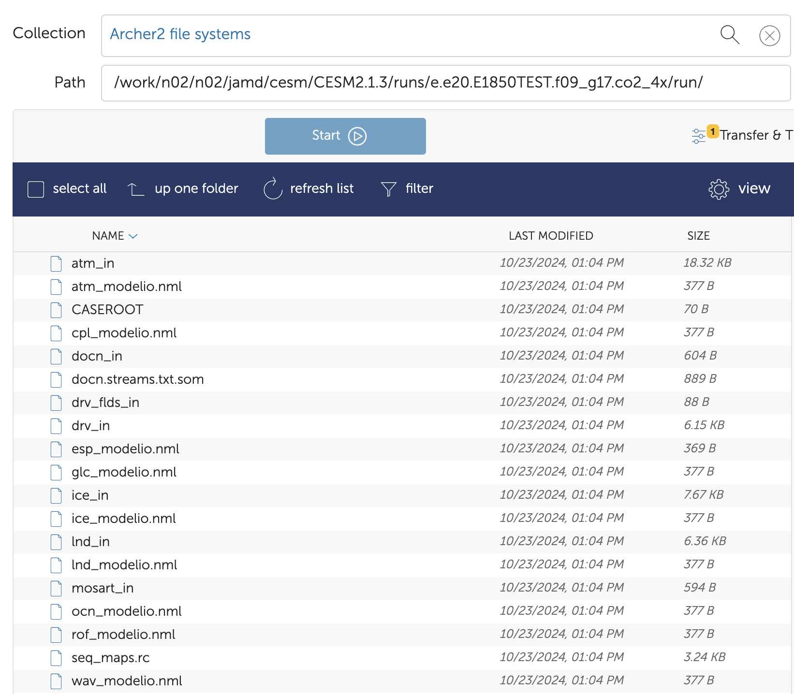
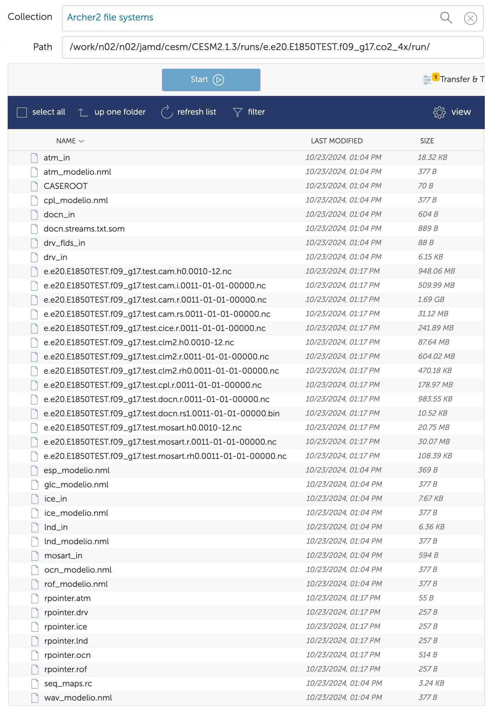

# Basics

This page just gives some useful information regarding the Community Earth System Model.

## Resources
* [Discussion Forum](https://bb.cgd.ucar.edu/cesm/)
* [Tutorial](https://ncar.github.io/CESM-Tutorial/README.html) (particularly useful)
* [Practical](https://www2.cesm.ucar.edu/events/tutorials/2022/files/)
* [Analysis Example](https://brian-rose.github.io/ClimateLaboratoryBook/courseware/introducing-cesm.html#)
* [My code](../code/cesm/load.md) to help with analysis 

## Paths on ARCHER2
Paths pointing to different parts of the CESM model are [given below](https://ncar.github.io/CESM-Tutorial/notebooks/basics/cesm_workspaces.html).

The paths that are not case specific should be available to use in ARCHER2 after [loading the CESM module](#step-2-load-modules) through
`module load CESM2/2.1.3`.


* `$CESM_ROOT = /work/$GROUP/$GROUP/$USER/cesm/CESM2.1.3` <br/>
This is the overall directory containing all CESM stuff (for me, `$GROUP=n02` and `$USER=jamd`, giving: `$CESM_ROOT = /work/n02/n02/jamd/cesm/CESM2.1.3`)
* `$CESMDATA = $CESM_ROOT/cesm_inputdata`<br/>Path to input data.
* `$SRCROOT = $CESM_ROOT/my_cesm_sandbox`<br/>Path to CESM source code. `$CESM_LOC` will aslo refer to this directory.
* `$CIMEROOT = $CESM_ROOT/my_cesm_sandbox/cime`<br/>Path to the 
[Common Infrastructure for Modeling Earth](https://esmci.github.io/cime/versions/master/html/what_cime/index.html) part of the source code.
* `$CASEROOT = $CESM_ROOT/runs/$CASE/`<br/>Path to a particular experiment, as indicated by `$CASE`.
* `$EXEROOT = $CESM_ROOT/runs/$CASE/bld/`<br/>Path to the build directories of a particular experiment.
* `$RUNDIR = $CESM_ROOT/runs/$CASE/run/`<br/>Path to the run directories of a particular experiment.
* `$DOUT_S_ROOT = $CESM_ROOT/archive/$CASE/`<br/>Path to the archive3d model output.

## Code Components
CESM consists of several sub models [listed below](https://ncar.github.io/CESM-Tutorial/notebooks/basics/code/cesm_code_explore.html#step-3-examine-the-cesm-components-area). 
Output data is saved in a different location for each.


## Workflow
Here, I go through the [general steps](https://ncar.github.io/CESM-Tutorial/notebooks/basics/basics_overview.html) 
for running an CESM experiment on ARCHER2.

At any point, the [file](https://ncar.github.io/CESM-Tutorial/notebooks/basics/cesm_workflow/checking_jobs_and_status.html#casestatus-file) 
`$CESM_ROOT/runs/$CASE/CaseStatus` records commands run and whether each step has been successful.

#### Step 1 - Login
First, you need to login to ARCHER2 [using ssh](../hpc_basics/kennedy.md#login).

#### Step 2 - Load modules
Each time you login to ARCHER2, you need to load the python and CESM modules:

```bash
module load cray-python
module load CESM2/2.1.3
```

#### Step 3 - Create a case
Create a new case using:
```bash
create_newcase --case $CESM_ROOT/runs/CASE --compset COMPSET --res RES --project PROJECT
```

where for me, `PROJECT=n02-GLOBALEX`. 
You may need to add `--run-unsupported` to the end of this command if you get the following error:
*This compset and grid combination is untested in CESM.*

??? note "Casename convection"
    Experiment casenames have a [convention](https://www.cesm.ucar.edu/models/cesm2/naming-conventions#casenames):
    
    ```
    `<compset char>.<code base>.<compset shortname>.<res shortname>[.opt_desc_string].<nnn>[opt_char]`
    ```

    An example `$CASE = e.e20.ETEST.f19_g17.test`.

???+ note "Compsets"
    Compsets are listed [here](https://docs.cesm.ucar.edu/models/cesm2/config/compsets.html) and the names are 
    [explained here](https://ncar.github.io/CESM-Tutorial/notebooks/basics/cesm_workflow/create_newcase.html#compset):

    

???+ note "Resolution"
    Resolutions are listed [here](https://docs.cesm.ucar.edu/models/cesm2/config/grids.html) and the names are 
    [explained here](https://ncar.github.io/CESM-Tutorial/notebooks/basics/cesm_workflow/create_newcase.html#resolution):

    

#### Step 4 - Setup
Navigate to `$CASEROOT` and then invoke using `case.setup`, e.g. for `$CASE = e.e20.ETEST.f19_g17.test`:
```bash
cd $CESM_ROOT/runs/e.e20.ETEST.f19_g17.test
./case.setup
```

#### Step 5 - Customize namelists
At this stage, you need to specify the details of the experiment by [modifying the namelists](#namelists) and/or 
customizing the output.

#### Step 6 - Build
Next, the executable should be built through `case.build`:
```bash
./case.build
```
Again, this should be run from `$CASEROOT`.

#### Step 7 - Download input data
Next, the required input data, from which to start the model, should be downloaded:
```bash
./check_input_data --download
```
Again, this should be run from `$CASEROOT`.

#### Step 8 - Run model
Finally, you can run the model with `case.submit`:
```bash
./case.submit
```
Again, this should be run from `$CASEROOT`. Details of the experiment may need to be [changed](#xml-modifications) 
before submission using `xmlchange`.


## Model Output
If the model run is successful, the [CESM netcdf output](https://ncar.github.io/CESM-Tutorial/notebooks/basics/cesm_workflow/model_output.html) 
history files are automatically moved to the short term archive, located at `$DOUT_S_ROOT`. Otherwise, they are in `$RUNDIR`.

Output files should be moved somewhere else for more long term storage. This is likely to be JASMIN, and the 
files can be transferred with globus.

[Timing information](https://ncar.github.io/CESM-Tutorial/notebooks/modifications/xml/run_length/timing_files.html) 
is saved as `$CASEROOT/timing/cesm_timing.$CASE.$date`. The model throughput is the estimated number 
of model years that you can run in a wallclock day.

The `cpl.log` file at `$CESM_ROOT/archive/$CASE/logs` indicates whether successful. 
[It should](https://docs.archer2.ac.uk/research-software/cesm213_run/#run-the-case) end with 
`SUCCESSFUL TERMINATION OF CPL7-cesm`.

## XML Modifications
Some details of the experiment such as how long to run it, and on which queue to submit to, are 
specified with [xml variables](https://ncar.github.io/CESM-Tutorial/notebooks/modifications/xml/overview.html). 
These can be checked with `xmlquery` and modified with `xmlchange` from the 
`$CASEROOT` directory. This should be done just before [running the experiment](#step-8-run-model).

You can [check](https://ncar.github.io/CESM-Tutorial/notebooks/modifications/xml/model_control_files.html#searching-xml-variables-with-xmlquery) 
all variables containing the word `VAR` using `-p` for a partial match:

```bash
./xmlquery -p VAR
```

You can [change](https://ncar.github.io/CESM-Tutorial/notebooks/modifications/xml/model_control_files.html#editing-with-xmlchange)
the value of variable `VAR` to the new value of `new_val` using:

```bash
./xmlchange VAR=new_val
```

???+ note "Useful Variables"
    * `JOB_WALLCLOCK_TIME` - Max time to run job for. Must be less than max walltime of chosen `JOB_QUEUE`. This is
    listed on [ARCHER2 website](https://docs.archer2.ac.uk/user-guide/scheduler/#quality-of-service-qos).
    * `STOP_N` - Experiment will end after `STOP_N` `STOP_OPTION`.
    * `STOP_OPTION` - Unit of simulation time to indicate how long to run for e.g. `nmonths`, `nyears` or `ndays`.
    * `JOB_QUEUE` - Which queue to submit to. Most common on [ARCHER2](https://docs.archer2.ac.uk/user-guide/scheduler/#partitions) 
    are `standard` or `short`.
    * `CONTINUE_RUN` - `TRUE` to continue run from last restart file.
    * `RESUBMIT` - [Need to use](https://ncar.github.io/CESM-Tutorial/notebooks/modifications/xml/run_length/changing_run_length.html#resubmit-and-continue-run) 
    if experiment takes longer than max job time on partition being used.

#### Restarting
[Restart files](https://ncar.github.io/CESM-Tutorial/notebooks/modifications/xml/run_length/restarting.html) 
are written according to the `REST_OPTION` and `REST_N` settings. 
By default, this is set to be the same as `$STOP_OPTION` and `$STOP_N` i.e. one restart file per run.

The restart files are saved as `$DOUT_S_ROOT/rest/yyyy-mm-dd-ssss/`.

To [carry on running a model](https://ncar.github.io/CESM-Tutorial/notebooks/modifications/xml/run_length/restarting.html#continue-a-run) 
from a restart file, you need to set `CONTINUE_RUN=TRUE` using `xmlchange`. By default, it is `FALSE`, in which 
case the experiment would just be run from the beginning again.

Rather than conitnuing a run from when the last job finished, if you want to 
[restart from a specific point](https://ncar.github.io/CESM-Tutorial/notebooks/modifications/xml/run_length/restarting.html#backing-up-to-a-previous-restart), 
you can move the restart file into the `$RUNDIR`.

## Namelists
[Namelists](https://ncar.github.io/CESM-Tutorial/notebooks/namelist/overview.html) 
can be modified through the `user_nl_xxx` files in `$CASEROOT`:


This should be done after [setup](#step-4-setup) but before [build](#step-6-build). Note that the 
`_in` files only appear in `$CASEROOT` after `./case.build` and these should not be edited.

Optionally, can run `./preview_namelists` from `$CASEROOT` after editing namelists, but this is done anyway in 
`./case.build`

## Branch Run
This section describes how to do a [branch run](https://ncar.github.io/CESM-Tutorial/notebooks/modifications/xml/modify_run_type/hybrid_branch_restart.html#branch). 
This will take an experiment you have already run at a particular point 
in time as a starting condition, then modify the experiment somehow e.g. change $CO_2$ concentration, and continue the run.

The [workflow](#workflow) for this is exactly the same as you carried out for the experiment you want to branch off 
from up until [Step 5](#step-5-customize-namelists), except the [case name](#step-3-create-a-case) should be different.
E.g. if the initial experiment was called `e.e20.E1850TEST.f09_g17.test`, the branched experiment may be called
`e.e20.E1850TEST.f09_g17.branch`.

[Step 5](#step-5-customize-namelists) is where you make this experiment different from the experiment you have already
run, e.g. change $CO_2$ concentration through the variable `co2vmr` or `co2_vmr_rad` in the `user_nml_cam` 
[namelist file](#namelists).

Next, you should [build](#step-6-build) the executable as usual, but you can skip [downloading the input data](#step-7-download-input-data)
because you are starting from a restart file, not input data.

#### Branch Point
At this stage, you need to 
[specify the branch point](https://ncar.github.io/CESM-Tutorial/notebooks/modifications/xml/exercises/xml_runtype_exercise.html) 
by moving the relevant restart files into `$RUNDIR`.

To restart from the date `yyyy-mm-dd-ssss`, all the files in the [directory](#restarting) 
`$DOUT_S_ROOT/rest/yyyy-mm-dd-ssss/` of the initial experiment should be moved to `$RUNDIR` of the new experiment

??? note "Example"
    If I want to create a branch called `e.e20.E1850TEST.f09_g17.branch` from 1st January Year 11 of experiment called
    `e.e20.E1850TEST.f09_g17.test`, then I would move all the files in the directory 
    `$CESM_ROOT/archive/e.e20.E1850TEST.f09_g17.test/rest/0011-01-01-00000/` to
    `$RUNDIR = $CESM_ROOT/runs/e.e20.E1850TEST.f09_g17.branch/run/`.
    
    The `$RUNDIR` before and after this transfer is shown below. Afterwards, there are *.nc* and *rcpointer* files
    in the `$RUNDIR`.

    === "Before"
        {width="500"}

    === "After"
        {width="500"}

Once the restart files have been transferred, `xmlchange` must be used to indicate that this experiment is a branch run.
If we are branching off from an experiment with casename `old_case` at the date `yyyy-mm-dd`, then you should run:

```bash
./xmlchange RUN_TYPE = branch
./xmlchange RUN_REFCASE = old_case
./xmlchange RUN_REFDATE = yyyy-mm-dd
./xmlchange GET_REFCASE = FALSE
```

??? note "Example"
    Continuing from our previous example, you would run:
    
    ```bash
    ./xmlchange RUN_TYPE = branch
    ./xmlchange RUN_REFCASE = e.e20.E1850TEST.f09_g17.test
    ./xmlchange RUN_REFDATE = 0011-01-01
    ./xmlchange GET_REFCASE = FALSE
    ```

After this, the branch job can be [submitted](#step-8-run-model) as normal, remembering to 
[specify the run duration etc](#xml-modifications).

