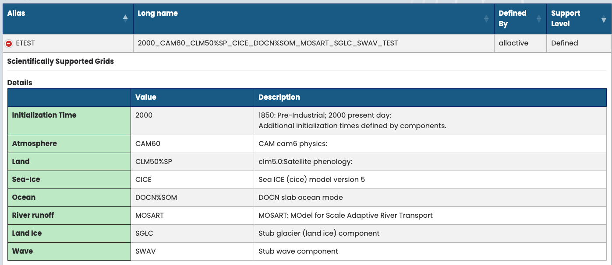
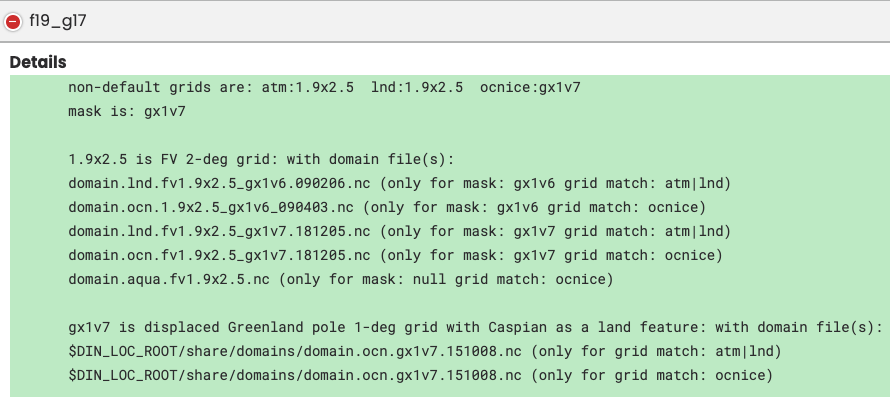
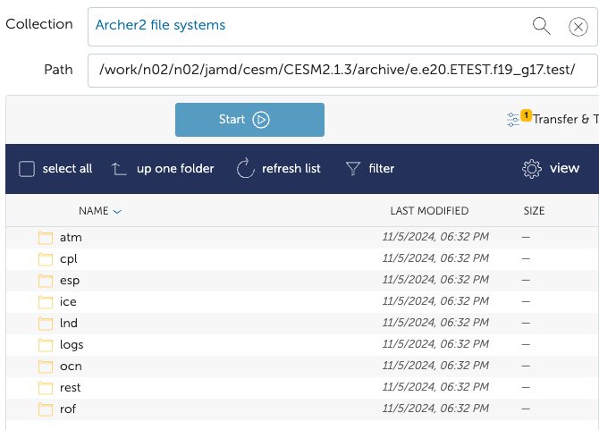
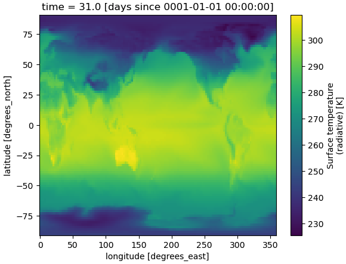

# First Run
Here I go through a step by step example of running a slab ocean experiment, with present day initialization. I 
use the `ETEST` [compset](https://docs.cesm.ucar.edu/models/cesm2/config/compsets.html) with `f19_g17` 
[resolution](https://docs.cesm.ucar.edu/models/cesm2/config/grids.html).

??? note "Details of `ETEST` and `f19_g17`"
    === "ETEST"
        {width="800"}

    === "f19_g17"
        {width="800"}

## Step 1 - Login
After [logging in](./basics.md#step-1-login) to ARCHER2, you should get a welcome message.

??? note "Terminal Output"
    ```bash
    Last login: Tue Nov  5 15:59:18 2024 from 2.98.194.178
    #######################################################################################
    
            @@@@@@@@@
         @@@         @@@            _      ____     ____   _   _   _____   ____    ____
       @@@    @@@@@    @@@         / \    |  _ \   / ___| | | | | | ____| |  _ \  |___ \
      @@@   @@     @@   @@@       / _ \   | |_) | | |     | |_| | |  _|   | |_) |   __) |
      @@   @@  @@@  @@   @@      / ___ \  |  _ <  | |___  |  _  | | |___  |  _ <   / __/
      @@   @@  @@@  @@   @@     /_/   \_\ |_| \_\  \____| |_| |_| |_____| |_| \_\ |_____|
      @@@   @@     @@   @@@
       @@@    @@@@@    @@@       https://www.archer2.ac.uk/support-access/
         @@@         @@@
            @@@@@@@@@
    
     -         U K R I         -        E P C C        -         H P E   C r a y         -
    
    Hostname:     ln02
    Distribution: SLES 15.4 4
    CPUS:         256
    Memory:       515.3GB
    Configured:   2024-07-04
    
    ######################################################################################
    ---------------------------------Welcome to ARCHER2-----------------------------------
    ######################################################################################
    
    /usr/bin/manpath: can't set the locale; make sure $LC_* and $LANG are correct
    ```

## Step 2 - Load modules

After [successfully loading the modules](./basics.md#step-2-load-modules), there are a few messages printed to terminal.

??? note "Terminal Output"
    ```bash
    jamd@ln02:~> module load cray-python
    jamd@ln02:~> module load CESM2/2.1.3
    
    Lmod is automatically replacing "cce/15.0.0" with "gcc/11.2.0".
    
    
    Lmod is automatically replacing "PrgEnv-cray/8.3.3" with "PrgEnv-gnu/8.3.3".
    
    
    Due to MODULEPATH changes, the following have been reloaded:
      1) cray-mpich/8.1.23
    ```

After this, I make `$CESM_ROOT` the current directory:

```bash
jamd@ln02:~> cd $CESM_ROOT
jamd@ln02:/work/n02/n02/jamd/cesm/CESM2.1.3> 
```

## Step 3 - Create a case
To [create the case](./basics.md#step-3-create-a-case) with `ETEST` compset and `f19_g17` resolution, I run:

```bash
jamd@ln02:/work/n02/n02/jamd/cesm/CESM2.1.3> $CIMEROOT/scripts/create_newcase --case $CESM_ROOT/runs/e.e20.ETEST.f19_g17.test --compset ETEST --res f19_g17 --project n02-GLOBALEX --run-unsupported
```

where I have used the case name of `e.e20.ETEST.f19_g17.test` following the 
[convection](https://www.cesm.ucar.edu/models/cesm2/naming-conventions#casenames) with the descriptive string `test`.

??? note "Terminal Output"
    Following this command, a bunch of stuff will be printed to terminal, the last of which should be:
    ```bash
    Pes comments: none
     Compset is: 2000_CAM60_CLM50%SP_CICE_DOCN%SOM_MOSART_SGLC_SWAV_TEST 
     Grid is: a%1.9x2.5_l%1.9x2.5_oi%gx1v7_r%r05_g%null_w%null_m%gx1v7 
     Components in compset are: ['cam', 'clm', 'cice', 'docn', 'mosart', 'sglc', 'swav', 'sesp', 'drv', 'dart'] 
    No charge_account info available, using value from PROJECT
    No project info available
    cesm model version found: cesm2.1.3-rc.01
    Batch_system_type is slurm
    job is case.run USER_REQUESTED_WALLTIME None USER_REQUESTED_QUEUE None WALLTIME_FORMAT %H:%M:%S
    job is case.st_archive USER_REQUESTED_WALLTIME None USER_REQUESTED_QUEUE None WALLTIME_FORMAT %H:%M:%S
     Creating Case directory /work/n02/n02/jamd/cesm/CESM2.1.3/runs/e.e20.ETEST.f19_g17.test
    
    ```


## Step 4 - Setup
Now the experiment has been created, we need to make `$CESM_ROOT/runs/e.e20.ETEST.f19_g17.test` the current directory,
before [running](./basics.md#step-4-setup) `case.setup`:

```bash
jamd@ln02:/work/n02/n02/jamd/cesm/CESM2.1.3> cd $CESM_ROOT/runs/e.e20.ETEST.f19_g17.test
jamd@ln02:/work/n02/n02/jamd/cesm/CESM2.1.3/runs/e.e20.ETEST.f19_g17.test> ./case.setup
```

??? note "Terminal Output"
    ```bash
    jamd@ln02:/work/n02/n02/jamd/cesm/CESM2.1.3/runs/e.e20.ETEST.f19_g17.test> ./case.setup
    Setting resource.RLIMIT_STACK to -1 from (8388608, -1)
    /work/n02/n02/jamd/cesm/CESM2.1.3/runs/e.e20.ETEST.f19_g17.test/env_mach_specific.xml already exists, delete to replace
    job is case.run USER_REQUESTED_WALLTIME None USER_REQUESTED_QUEUE None WALLTIME_FORMAT %H:%M:%S
    Creating batch scripts
    Writing case.run script from input template /mnt/lustre/a2fs-work2/work/n02/n02/jamd/cesm/CESM2.1.3/my_cesm_sandbox/cime/config/cesm/machines/template.case.run
    Creating file .case.run
    Writing case.st_archive script from input template /mnt/lustre/a2fs-work2/work/n02/n02/jamd/cesm/CESM2.1.3/my_cesm_sandbox/cime/config/cesm/machines/template.st_archive
    Creating file case.st_archive
    Creating user_nl_xxx files for components and cpl
    If an old case build already exists, might want to run 'case.build --clean' before building
    You can now run './preview_run' to get more info on how your case will be run
    ```

## Step 5 - Customize namelists
For this example, we keep the default experiment parameters so don't need to 
[change the namelist files](./basics.md#step-5-customize-namelists).

## Step 6 - Build
Now we [build the executable](./basics.md#step-6-build):

```bash
jamd@ln02:/work/n02/n02/jamd/cesm/CESM2.1.3/runs/e.e20.ETEST.f19_g17.test> ./case.build
```

This step takes a while (about 5 minutes for this example), but should end with the following message:

```bash
Time spent not building: 6.407066 sec
Time spent building: 253.041738 sec
MODEL BUILD HAS FINISHED SUCCESSFULLY
```

??? note "Terminal Output"
    A lot is printed to terminal at this stage, the last of which is shown below.

    ```bash
    Building atm with output to /work/n02/n02/jamd/cesm/CESM2.1.3/runs/e.e20.ETEST.f19_g17.test/bld/atm.bldlog.241105-175344
    Building ice with output to /work/n02/n02/jamd/cesm/CESM2.1.3/runs/e.e20.ETEST.f19_g17.test/bld/ice.bldlog.241105-175344
    Building ocn with output to /work/n02/n02/jamd/cesm/CESM2.1.3/runs/e.e20.ETEST.f19_g17.test/bld/ocn.bldlog.241105-175344
    Building rof with output to /work/n02/n02/jamd/cesm/CESM2.1.3/runs/e.e20.ETEST.f19_g17.test/bld/rof.bldlog.241105-175344
    Building glc with output to /work/n02/n02/jamd/cesm/CESM2.1.3/runs/e.e20.ETEST.f19_g17.test/bld/glc.bldlog.241105-175344
    Building wav with output to /work/n02/n02/jamd/cesm/CESM2.1.3/runs/e.e20.ETEST.f19_g17.test/bld/wav.bldlog.241105-175344
    Building esp with output to /work/n02/n02/jamd/cesm/CESM2.1.3/runs/e.e20.ETEST.f19_g17.test/bld/esp.bldlog.241105-175344
    sesp built in 4.198223 seconds
    sglc built in 4.202698 seconds
    swav built in 4.218285 seconds
    docn built in 5.041561 seconds
    Component rof build complete with 4 warnings
    mosart built in 10.101223 seconds
    Component ice build complete with 10 warnings
    cice built in 25.621810 seconds
    Component atm build complete with 109 warnings
    cam built in 101.564669 seconds
    Building cesm with output to /work/n02/n02/jamd/cesm/CESM2.1.3/runs/e.e20.ETEST.f19_g17.test/bld/cesm.bldlog.241105-175344 
    Time spent not building: 6.407066 sec
    Time spent building: 253.041738 sec
    MODEL BUILD HAS FINISHED SUCCESSFULLY
    ```

## Step 7 - Download Input data
The [input data](./basics.md#step-7-download-input-data) is downloaded with the command:

```bash
jamd@ln02:/work/n02/n02/jamd/cesm/CESM2.1.3/runs/e.e20.ETEST.f19_g17.test> ./check_input_data --download
```

??? note "Terminal Output"
    In this step, you will get a lot of messages of the form 
    `Model missing file...Trying to download file...using WGET protocol...SUCCESS`. 

    An few examples are given below:

    ```bash
      Model cam missing file srf_emis_specifier for SOAG = '/work/n02/n02/jamd/cesm/CESM2.1.3/cesm_inputdata/atm/cam/chem/emis/CMIP6_emissions_2000climo/emissions-cmip6_SOAGx1.5_anthro_surface_2000climo_0.9x1.25_c20170608.nc'
    Trying to download file: 'atm/cam/chem/emis/CMIP6_emissions_2000climo/emissions-cmip6_SOAGx1.5_anthro_surface_2000climo_0.9x1.25_c20170608.nc' to path '/work/n02/n02/jamd/cesm/CESM2.1.3/cesm_inputdata/atm/cam/chem/emis/CMIP6_emissions_2000climo/emissions-cmip6_SOAGx1.5_anthro_surface_2000climo_0.9x1.25_c20170608.nc' using WGET protocol.
    SUCCESS
    
      Model cam missing file srf_emis_specifier for SOAG = '/work/n02/n02/jamd/cesm/CESM2.1.3/cesm_inputdata/atm/cam/chem/emis/CMIP6_emissions_2000climo/emissions-cmip6_SOAGx1.5_bb_surface_2000climo_0.9x1.25_c20170322.nc'
    Trying to download file: 'atm/cam/chem/emis/CMIP6_emissions_2000climo/emissions-cmip6_SOAGx1.5_bb_surface_2000climo_0.9x1.25_c20170322.nc' to path '/work/n02/n02/jamd/cesm/CESM2.1.3/cesm_inputdata/atm/cam/chem/emis/CMIP6_emissions_2000climo/emissions-cmip6_SOAGx1.5_bb_surface_2000climo_0.9x1.25_c20170322.nc' using WGET protocol.
    SUCCESS
    
      Model cam missing file srf_emis_specifier for SOAG = '/work/n02/n02/jamd/cesm/CESM2.1.3/cesm_inputdata/atm/cam/chem/emis/CMIP6_emissions_2000climo/emissions-cmip6_SOAGx1.5_biogenic_surface_2000climo_0.9x1.25_c20170322.nc'
    Trying to download file: 'atm/cam/chem/emis/CMIP6_emissions_2000climo/emissions-cmip6_SOAGx1.5_biogenic_surface_2000climo_0.9x1.25_c20170322.nc' to path '/work/n02/n02/jamd/cesm/CESM2.1.3/cesm_inputdata/atm/cam/chem/emis/CMIP6_emissions_2000climo/emissions-cmip6_SOAGx1.5_biogenic_surface_2000climo_0.9x1.25_c20170322.nc' using WGET protocol.
    SUCCESS
    ```

This stage will take a while if no input data already exists, on the order of 30 minutes for 1 degree resolution.
If the input data was downloaded successfully, running `./check_input_data` should show the following:

```bash
jamd@ln02:/work/n02/n02/jamd/cesm/CESM2.1.3/runs/e.e20.ETEST.f19_g17.test> ./check_input_data           
Setting resource.RLIMIT_STACK to -1 from (8388608, -1)
Loading input file list: 'Buildconf/cice.input_data_list'
Loading input file list: 'Buildconf/mosart.input_data_list'
Loading input file list: 'Buildconf/docn.input_data_list'
Loading input file list: 'Buildconf/cpl.input_data_list'
Loading input file list: 'Buildconf/clm.input_data_list'
Loading input file list: 'Buildconf/cam.input_data_list'
```

## Step 8 - Run model
Before [running the model](./basics.md#step-8-run-model), you need [change](./basics.md#xml-modifications) 
the duration of the simulation (default is 5 days), 
and specify which partition to submit the job to (default is `standard`). 
Here, I change it to 1 month on the `short` partition which has a max walltime of 20 minutes:

```bash
jamd@ln02:/work/n02/n02/jamd/cesm/CESM2.1.3/runs/e.e20.ETEST.f19_g17.test> ./xmlchange JOB_QUEUE=short      
jamd@ln02:/work/n02/n02/jamd/cesm/CESM2.1.3/runs/e.e20.ETEST.f19_g17.test> ./xmlchange JOB_WALLCLOCK_TIME=20:00   
jamd@ln02:/work/n02/n02/jamd/cesm/CESM2.1.3/runs/e.e20.ETEST.f19_g17.test> ./xmlchange STOP_N=1       
jamd@ln02:/work/n02/n02/jamd/cesm/CESM2.1.3/runs/e.e20.ETEST.f19_g17.test> ./xmlchange STOP_OPTION=nmonths
```

??? note "Checking using `xmlquery`"
    After the above changes, you can use `./xmlquery -p JOB` to check the `JOB_QUEUE` and `JOB_WALLCLOCK_TIME` have 
    changed:
    ```bash
    jamd@ln02:/work/n02/n02/jamd/cesm/CESM2.1.3/runs/e.e20.ETEST.f19_g17.test> ./xmlquery -p JOB
    
    Results in group case.run
            JOB_QUEUE: short
            JOB_WALLCLOCK_TIME: 20:00
    
    Results in group case.st_archive
            JOB_QUEUE: short
            JOB_WALLCLOCK_TIME: 20:00
    
    Results in group run_begin_stop_restart
            JOB_IDS: 
            JOB_PRIORITY: regular
    ```

    and `./xmlquery -p STOP` to check `STOP_N` and `STOP_OPTION`:

    ```bash
    jamd@ln02:/work/n02/n02/jamd/cesm/CESM2.1.3/runs/e.e20.ETEST.f19_g17.test> ./xmlquery -p STOP

    Results in group run_begin_stop_restart
            STOP_DATE: -999
            STOP_N: 1
            STOP_OPTION: nmonths
    ```

Now we can run the job:

```bash
jamd@ln02:/work/n02/n02/jamd/cesm/CESM2.1.3/runs/e.e20.ETEST.f19_g17.test> ./case.submit 
```

If successful, you should get information printed to terminal about the job id:

```bash
Submitted job id is 7977850
Submitted job case.run with id 7977849
Submitted job case.st_archive with id 7977850
```

??? note "Terminal Output"
    The full terminal output is:
    
    ```bash
    jamd@ln02:/work/n02/n02/jamd/cesm/CESM2.1.3/runs/e.e20.ETEST.f19_g17.test> ./case.submit 
    Setting resource.RLIMIT_STACK to -1 from (8388608, -1)
    Creating component namelists
       Calling /mnt/lustre/a2fs-work2/work/n02/n02/jamd/cesm/CESM2.1.3/my_cesm_sandbox/components/cam//cime_config/buildnml
    CAM namelist copy: file1 /work/n02/n02/jamd/cesm/CESM2.1.3/runs/e.e20.ETEST.f19_g17.test/Buildconf/camconf/atm_in file2 /work/n02/n02/jamd/cesm/CESM2.1.3/runs/e.e20.ETEST.f19_g17.test/run/atm_in 
       Calling /mnt/lustre/a2fs-work2/work/n02/n02/jamd/cesm/CESM2.1.3/my_cesm_sandbox/components/clm//cime_config/buildnml
       Calling /mnt/lustre/a2fs-work2/work/n02/n02/jamd/cesm/CESM2.1.3/my_cesm_sandbox/components/cice//cime_config/buildnml
       Calling /mnt/lustre/a2fs-work2/work/n02/n02/jamd/cesm/CESM2.1.3/my_cesm_sandbox/cime/src/components/data_comps/docn/cime_config/buildnml
       Calling /mnt/lustre/a2fs-work2/work/n02/n02/jamd/cesm/CESM2.1.3/my_cesm_sandbox/components/mosart//cime_config/buildnml
       Calling /mnt/lustre/a2fs-work2/work/n02/n02/jamd/cesm/CESM2.1.3/my_cesm_sandbox/cime/src/components/stub_comps/sglc/cime_config/buildnml
       Calling /mnt/lustre/a2fs-work2/work/n02/n02/jamd/cesm/CESM2.1.3/my_cesm_sandbox/cime/src/components/stub_comps/swav/cime_config/buildnml
       Calling /mnt/lustre/a2fs-work2/work/n02/n02/jamd/cesm/CESM2.1.3/my_cesm_sandbox/cime/src/components/stub_comps/sesp/cime_config/buildnml
       Calling /mnt/lustre/a2fs-work2/work/n02/n02/jamd/cesm/CESM2.1.3/my_cesm_sandbox/cime/src/drivers/mct/cime_config/buildnml
    Finished creating component namelists
    Checking that inputdata is available as part of case submission
    Setting resource.RLIMIT_STACK to -1 from (-1, -1)
    Loading input file list: 'Buildconf/cice.input_data_list'
    Loading input file list: 'Buildconf/mosart.input_data_list'
    Loading input file list: 'Buildconf/docn.input_data_list'
    Loading input file list: 'Buildconf/cpl.input_data_list'
    Loading input file list: 'Buildconf/clm.input_data_list'
    Loading input file list: 'Buildconf/cam.input_data_list'
    Check case OK
    submit_jobs case.run
    Submit job case.run
    Submitting job script sbatch --time 20:00 -q short --account n02-GLOBALEX --export=ALL /mnt/lustre/a2fs-work2/work/n02/n02/jamd/cesm/CESM2.1.3/runs/e.e20.ETEST.f19_g17.test/.case.run --resubmit
    Submitted job id is 7977849
    Submit job case.st_archive
    Submitting job script sbatch --time 20:00 -q short --account n02-GLOBALEX --export=ALL  --dependency=afterok:7977849 /mnt/lustre/a2fs-work2/work/n02/n02/jamd/cesm/CESM2.1.3/runs/e.e20.ETEST.f19_g17.test/case.st_archive --resubmit
    Submitted job id is 7977850
    Submitted job case.run with id 7977849
    Submitted job case.st_archive with id 7977850
    ```

The progress of the job can be monitored and managed with the usual [slurm](../hpc_basics/slurm.md) commands:

```bash
jamd@ln02:/work/n02/n02/jamd/cesm/CESM2.1.3/runs/e.e20.ETEST.f19_g17.test> squeue -u jamd
             JOBID PARTITION     NAME     USER ST       TIME  NODES NODELIST(REASON)
           7977850  standard st_archi     jamd PD       0:00      1 (Dependency)
           7977849  standard run.e.e2     jamd  R       1:52      6 nid[006831,006833,006836,006844-006845,006849]
```

## Model Output
The [model output](./basics.md#model-output) should be located in 
`$DOUT_S_ROOT = /work/n02/n02/jamd/cesm/CESM2.1.3/archive/e.e20.ETEST.f19_g17.test/` if successful with files 
corresponding to each of the [model components](./basics.md#code-components), as well as restart and
log files:

{width="500"}

### Timing
Timing information can be found at `$CASEROOT/timing/cesm_timing.$CASE.$date`. For this experiment, 
the file is: 

`/work/n02/n02/jamd/cesm/CESM2.1.3/runs/e.e20.ETEST.f19_g17.test/timing/cesm_timing.e.e20.ETEST.f19_g17.test.7977849.241105-182147`

??? note "Timing File"
    The timing file is quite long, the first section is shown below. 
    The most useful information is in the *Overall Metrics* section.
    
    ```text
    ---------------- TIMING PROFILE ---------------------
      Case        : e.e20.ETEST.f19_g17.test
      LID         : 7977849.241105-182147
      Machine     : archer2
      Caseroot    : /work/n02/n02/jamd/cesm/CESM2.1.3/runs/e.e20.ETEST.f19_g17.test
      Timeroot    : /work/n02/n02/jamd/cesm/CESM2.1.3/runs/e.e20.ETEST.f19_g17.test/Tools
      User        : jamd
      Curr Date   : Tue Nov  5 18:31:13 2024
      grid        : a%1.9x2.5_l%1.9x2.5_oi%gx1v7_r%r05_g%null_w%null_m%gx1v7
      compset     : 2000_CAM60_CLM50%SP_CICE_DOCN%SOM_MOSART_SGLC_SWAV_TEST
      run_type    : startup, continue_run = FALSE (inittype = TRUE)
      stop_option : nmonths, stop_n = 1
      run_length  : 31 days (30.979166666666668 for ocean)
    
      component       comp_pes    root_pe   tasks  x threads instances (stride) 
      ---------        ------     -------   ------   ------  ---------  ------  
      cpl = cpl        512         0        512    x 1       1      (1     ) 
      atm = cam        512         0        512    x 1       1      (1     ) 
      lnd = clm        256         0        256    x 1       1      (1     ) 
      ice = cice       256         256      256    x 1       1      (1     ) 
      ocn = docn       256         512      256    x 1       1      (1     ) 
      rof = mosart     256         0        256    x 1       1      (1     ) 
      glc = sglc       128         0        128    x 1       1      (1     ) 
      wav = swav       128         0        128    x 1       1      (1     ) 
      esp = sesp       1           0        1      x 1       1      (1     ) 
    
      total pes active           : 768 
      mpi tasks per node               : 128 
      pe count for cost estimate : 768 
    
      Overall Metrics: 
        Model Cost:             798.38   pe-hrs/simulated_year 
        Model Throughput:        23.09   simulated_years/day 
    
        Init Time   :     234.999 seconds 
        Run Time    :     317.848 seconds       10.253 seconds/day 
        Final Time  :       0.004 seconds 
    
        Actual Ocn Init Wait Time     :     308.436 seconds 
        Estimated Ocn Init Run Time   :       0.001 seconds 
        Estimated Run Time Correction :       0.000 seconds 
          (This correction has been applied to the ocean and total run times)
    ```

### Log
The `cpl.log` file can be found at `$CESM_ROOT/archive/$CASE/logs`. For this example, the path is:

`/work/n02/n02/jamd/cesm/CESM2.1.3/archive/e.e20.ETEST.f19_g17.test/logs/cpl.log.7977849.241105-182147`

This should end with `SUCCESSFUL TERMINATION OF CPL7-cesm.` if the simulation ran correctly.

??? note "Log File"
    The file is very long, but the last SUCCESSFUL part is given below for this experiment:

    ```text
    (seq_mct_drv): ===============          SUCCESSFUL TERMINATION OF CPL7-cesm ===============
    (seq_mct_drv): ===============        at YMD,TOD =   00010201       0         ===============
    (seq_mct_drv): ===============  # simulated days (this run) =       31.000  ===============
    (seq_mct_drv): ===============  compute time (hrs)          =        0.088  ===============
    (seq_mct_drv): ===============  # simulated years / cmp-day =       23.087  ===============
    (seq_mct_drv): ===============  pes min memory highwater  (MB)     890.039  ===============
    (seq_mct_drv): ===============  pes max memory highwater  (MB)    7045.794  ===============
    (seq_mct_drv): ===============  pes min memory last usage (MB)      62.108  ===============
    (seq_mct_drv): ===============  pes max memory last usage (MB)     660.740  ===============
    ```

### First Plot
After transferring the output data in `$DOUT_S_ROOT` to JASMIN, the `load_dataset` 
[function](../code/cesm/load.md#isca_tools.cesm.load.load_dataset) can be used to load the dataset, and 
the `print_ds_var_list` [function](../code/utils/base.md#isca_tools.utils.base.print_ds_var_list) to find out 
what variables are contained in the output data.

Below, I load the atmospheric dataset, find the temperature related variables in the Dataset and plot the 
surface temperature averaged over the first month.

=== "Code"
    ```python
    import sys
    sys.path.append('/home/users/jamd1/Isca/')
    import isca_tools
    # var_keep = ['TS', 'FSNT', 'FLNT', 'gw', 'LHFLX', 'SHFLX', 'FLNS', 'FSNS', 'PRECSC', 'PRECSL']
    exp_name = 'e.e20.ETEST.f19_g17.test'
    ds = isca_tools.cesm.load_dataset(exp_name, decode_times=False).load()
    isca_tools.utils.print_ds_var_list(ds, 'temp')
    ds.TS.plot()
    ```
=== "Output"
    ```text
    RTPTHLP_CLUBB: Temp. Moist. Covariance
    STEND_CLUBB: Temperature tendency
    T: Temperature
    THLP2_CLUBB: Temperature Variance
    TREFHT: Reference height temperature
    TS: Surface temperature (radiative)
    TSMN: Minimum surface temperature over output period
    TSMX: Maximum surface temperature over output period
    ```
=== "Plot"
    {width="500"}

Note that for this to work, the `isca_tools` [directory](https://github.com/jduffield65/Isca/tree/main/isca_tools)
has the path `/home/users/jamd1/Isca/isca_tools` on JASMIN.

