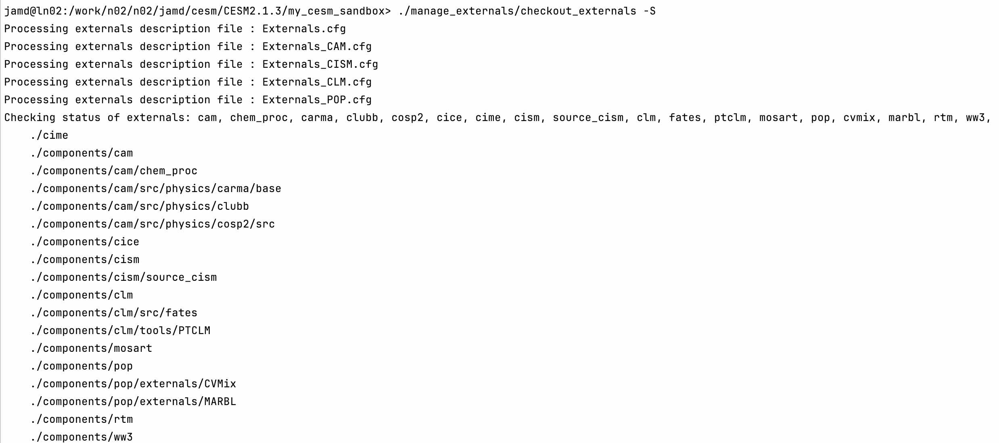

# Installation on Archer2
Here, I go through the procedure for installing CESM version 2.1.3 on ARCHER2. These are mainly
based on the [instructions on the ARCHER2 website](https://docs.archer2.ac.uk/research-software/cesm213_setup/) 
but correct them, so it actually works.

## Step 1 - ARCHER2 Account
First, you need to [setup an ARCHER2 account](https://docs.archer2.ac.uk/quick-start/quickstart-users/) and 
then [connect using ssh](https://docs.archer2.ac.uk/user-guide/connecting/).

## Step 2 - Downloading CESM 2.1.3 And Setting Up The Directory Structure
This step is the same as on the [ARCHER2 website](https://docs.archer2.ac.uk/research-software/cesm213_setup/#downloading-cesm-213-and-setting-up-the-directory-structure), i.e.
you need to run:

```bash
module load cray-python
source /work/n02/shared/CESM2/setup_cesm213.sh
```

This script will create a directory at `$CESM_ROOT`, defaulting to `/work/$GROUP/$GROUP/$USER/cesm/CESM2.1.3`, so for me 
with `$GROUP=n02`, and `$USER=jamd`, `$CESM_ROOT = /work/n02/n02/jamd/cesm/CESM2.1.3/`. 

Note `$CESM_ROOT` and `$CESM_LOC` should both exist after running these commands and be equivalent.

## Step 3 - Changes to `$CESM_ROOT/Externals.cfg`
A couple of sections in the file `$CESM_ROOT/Externals.cfg` need modifying. First, change the CIME section from:

???+ note "Editing files on ARCHER2"
    You can open or edit a file using the [nano](https://help.dreamhost.com/hc/en-us/articles/115006413028-Creating-and-editing-a-file-via-SSH).
    
    * `nano index.html` opens the `index.html` file, which can then be edited. 
    * `Ctrl + O` to save the file, and confirm with `Enter`
    * `Ctrl + X` to close `nano`

    Alternatively, [globus](https://docs.archer2.ac.uk/data-tools/globus/) can be used to transfer the file to your local
    laptop, where you can make the necessary edits, before sending it back to overwrite the file on ARCHER2.

```bash
[cime]
tag = cime5.6.32
protocol = git
repo_url = https://github.com/ESMCI/cime
local_path = cime
required = True
```

to (note when I did this, I did not include the `externals = Externals_cime.cfg` addition):

```bash
[cime]
branch = maint-5.6
protocol = git
repo_url = https://github.com/ESMCI/cime
local_path = cime
externals = Externals_cime.cfg
required = True
```

The CAM section in the same file also needs changing. This is the step that was missing from the ARCHER2 website, 
but I think it is [there](https://docs.archer2.ac.uk/research-software/cesm213_setup/#linking-and-downloading-components) 
now. This needs changing from:

```bash
[cam]
tag = cam_cesm2_1_rel_41
protocol = git
repo_url = https://github.com/ESCOMP/CAM
local_path = components/cam
externals = Externals_CAM.cfg
required = True
```

to:

```bash
[cam]
tag = cam_cesm2_1_rel
protocol = git
repo_url = https://github.com/ESCOMP/CAM
local_path = components/cam
externals = Externals_CAM.cfg
required = True
```

## Step 4 - Downloading Components
Now you can download the external components by running the following commands:

```bash
cd $CESM_ROOT
./manage_externals/checkout_externals
```

??? note "Confirming successful download"
    To confirm a successful download of all components, you can run checkout_externals with the status flag to show the 
    status of the externals:

    ```bash
    ./manage_externals/checkout_externals -S
    ```

    This should show a clean status for all externals, with no characters in the first two columns of output, 
    as in this example:

    {width="500"}

    This comes from the [CESM website](https://escomp.github.io/CESM/versions/cesm2.2/html/downloading_cesm.html) 
    (but the screenshot is from my installation).

## Step 5 - Building cprnc
cprnc is a generic tool for analyzing a netcdf file or comparing two netcdf files. It is used in various places by CESM 
and the source is included with cime. My procedure for building it differs slightly from that on the 
[ARCHER2 website](https://docs.archer2.ac.uk/research-software/cesm213_setup/#building-cprnc).

First, load `CESM2/2.1.3` and navigate to `$CIMEROOT/tools/cprnc`:

```bash
module load CESM2/2.1.3
cd $CIMEROOT/tools/
```

where `$CIMEROOT = $CESM_ROOT/my_cesm_sandbox/cime`. For me, I am in the directory `/work/n02/n02/jamd/cesm/CESM2.1.3/my_cesm_sandbox/cime/tools`
at this stage.

If the directory `$CIMEROOT/tools/cprnc` does not exist (it did not for me) then create and enter it:

```bash
cd $CIMEROOT/tools/
mkdir cprnc
cd ./cprnc
```

From the `$CIMEROOT/tools/cprnc` directory, run the following three commands (one after the other):

```bash
../configure --macros-format=Makefile--mpilib=mpi-serial
sed -i '/}}/d' .env_mach_specific.sh
source ./.env_mach_specific.sh && make
```

I received the following message after the last of these commands, which is expected:

```text
The following dependent module(s) are not currently loaded: cray-hdf5-parallel (required by: CESM2/2.1.3), cray-netcdf-hdf5parallel (required by: CESM2/2.1.3), cray-parallel-netodf (required by: CESM2/2.1.3)
```

Once this step has been completed, you are ready to run a [simple test case](./first_run.md).
