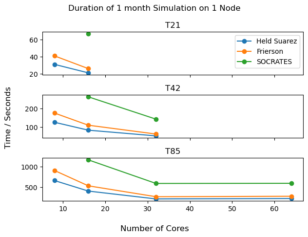

# Benchmarking

To see how the number of cores per node and the resolution of the simulation affect how long the experiments 
take to run, you can run the 
[same simulation with different parameters](../hpc_basics/slurm.md#multiple-jobs-with-environmental-variables).

## Scripts
To do this, I created the following files and added them to the folder `/gpfs1/home/jamd1/isca_jobs/benchmarking`:

=== "benchmark_run.py"

    ``` python
    import os
    from os import system
    import sys
    import numpy as np
    import re
    from typing import Tuple

    # This script runs a single experiment with different resolution and number of cores. It then records the time
    # taken for each.    

    # Things to change
    experiment = 'held_suarez_test_case.py'  # python script to call is this in the benchmarking/experiment folder
    n_months = 1  # duration of simulation
    n_nodes = 1  # how many nodes to run on
    n_cores_list = [8, 16, 32]  # cores per node to iterate over, all would be [8, 16, 32]
    res_list = ['T21', 'T42', 'T85']  # horizontal resolution to iterate over, all would be ['T21', 'T42', 'T85']
    csv_file = 'task_times.csv'  # where to save how long each task took.
    
    
    def extract_number(f: str) -> Tuple[int, str]:
        # returns last number of string. If is no number, will return -1.
        s = re.findall(r'\d+', f)
        return int(s[-1]) if s else -1, f
    
    
    def get_max_folder_number(dir: str) -> int:
        # Finds maximum number at end of folder within the directory dir.
        # Will be -1 if no folders end in a number or if directory does not exist.
        if os.path.exists(dir):
            max_index = extract_number(max(os.listdir(dir), key=extract_number))[0]
        else:
            max_index = -1
        return max_index
    
    
    # get index of first iteration so does not overwrite previous data
    # first index would be 1 if experiment not yet run
    shell_script = 'benchmark.sh'  # bash script to call experiment
    experiment = experiment.replace('.py', '')  # make sure experiment name does not have .py suffix.
    python_script = os.path.join('experiments', experiment+'.py')
    # error .txt files saved as output/experiment/error{ind}.txt and similar for the output file
    starting_ind = int(np.clip(get_max_folder_number(f'output/{experiment}') + 1, 1, np.inf))
    
    if n_nodes == 1 and n_months <= 3:
        # If 1 node use debug partition as quicker
        partition = 'debug'
    else:
        # If more than 1 node, need to use other partition but will take much longer to run as need to queue.
        partition = 'parallel'
    
    # Iterate over all n_cores and resolutions provided
    ind = starting_ind
    for n_cores in n_cores_list:
        for res in res_list:
            output_file = f'output/{experiment}/output_run{ind}.txt'  # name of file containing stuff printed to console
            error_file = f'output/{experiment}/error_run{ind}.txt'  # name of file containing errors printed to console
            system(f'bash {shell_script} {python_script} {ind} {partition} {n_nodes} {n_cores} {res} {n_months} {csv_file} '
                   f'{output_file} {error_file}')
            ind += 1

    ```

=== "benchmark.sh"

    ``` bash
    #!/bin/bash
    sbatch <<EOT
    #!/bin/bash
    #SBATCH --job-name=$(basename "$1" .py)  # make job name be the same as the python script without prefix and suffix.
    #SBATCH --output=$9  # output to console saved as text file
    #SBATCH --error=${10}    # errors to console saved as text file
    #SBATCH --time=02:00:00 # maximum walltime for the job
    #SBATCH --nodes=$4 # specify number of nodes
    #SBATCH --ntasks-per-node=$5 # specify number of processors per node
    #SBATCH --mail-type=END # send email at job completion
    #SBATCH --mail-user=jamd1@st-andrews.ac.uk # email address
    #SBATCH --partition=$3 # queue to run on
    
    # Input parameters
    # $1 - python script indicating experiment to run e.g. experiments/held_suarez_test_case.py
    # $2 - index giving the run number for this experiment
    # $3 - partition indicating which queue to run experiment on e.g. 'debug' or 'singlenode'
    # $4 - n_nodes indicating number of nodes to run experiment on.
    # $5 - n_cores indicating the number of cores to use per node.
    # $6 - res indicating horizontal resolution to use for the experiment e.g. 'T42'
    # $7 - n_months indicates duration of the simulation in months.
    # $8 - csv file to save task times e.g. 'task_times.csv'
    # $9 - name of txt file where stuff printed to console saved e.g. console_output.txt
    # ${10} - name of txt file where errors printed to console saved e.g. console_error.txt
    
    # Save some of input parameters for use in python scripts
    export NMONTHS=$7
    export RES=$6
    export RUN_NO=$2
    
    # Run python script for experiment and record how long it takes
    cd /home/jamd1/isca_jobs/benchmarking/
    python record_time.py $8 START
    python $1
    python record_time.py $8 END
    
    exit 0
    EOT
    ```

=== "record_time.py"

    ```python
    import sys as sys
    import os
    import pandas as pd
    from datetime import datetime
    
    # This records the time and environmental variables into a csv file for a given Isca experiment.
    
    reformatted_GMT_timestamp = datetime.utcnow().strftime('[%Y,%m,%d,%H,%M,%S]')
    file_name = sys.argv[1]    # where csv file with task info is saved
    task_status = sys.argv[2]  # either start or end
    
    if task_status.lower() == 'start':
        # Initialise dictionary with all things that we want to save
        task_dict = {'Job Name': [os.environ['SLURM_JOB_NAME']],
                     'Run Number': [int(os.environ['RUN_NO'])],
                     'Partition': [os.environ['SLURM_JOB_PARTITION']],
                     'Resolution': [os.environ['RES']],
                     'Number of Nodes': [int(os.environ['SLURM_NNODES'])],
                     'Tasks Per Node': [int(os.environ['SLURM_NTASKS_PER_NODE'])],
                     'Simulation Duration (Months)': [int(os.environ['NMONTHS'])],
                     'Start Time (Y,M,D,H,M,S)': [reformatted_GMT_timestamp],
                     'End Time (Y,M,D,H,M,S)': [None],  # Set when call with 'end'
                     'Time/Seconds': [None]}            # Set when call with 'end'
        if os.path.exists(file_name):
            # If file exists, append to existing dataframe.
            df = pd.read_csv(file_name)
            df = pd.concat([df, pd.DataFrame(data=task_dict)], ignore_index=True)
        else:
            # If no file, create new dataframe.
            df = pd.DataFrame(data=task_dict)
    else:
        # If task finished, only record end time and duration of task
        df = pd.read_csv(file_name)
        df.loc[df.shape[0] - 1, 'End Time (Y,M,D,H,M,S)'] = reformatted_GMT_timestamp
        start_time = datetime.strptime(df.loc[df.shape[0] - 1, 'Start Time (Y,M,D,H,M,S)'], "[%Y,%m,%d,%H,%M,%S]")
        end_time = datetime.strptime(reformatted_GMT_timestamp, "[%Y,%m,%d,%H,%M,%S]")
        df.loc[df.shape[0] - 1, 'Time/Seconds'] = int((end_time-start_time).total_seconds())
    df.to_csv(file_name, index=False)  # save dataframe to a .csv file
    ```

=== "experiment/held_suarez_test_case.py"
    ```python
    import numpy as np
    import os
    from isca import DryCodeBase, DiagTable, Experiment, Namelist, GFDL_BASE
    
    # MODIFIED version of held_suarez_test_case.py script to allow for variables to be inherited
    # from the environment and to run for specified length of time.
    
    # Things that were set in benchmark.sh script - MODIFIED
    NCORES = int(os.environ["SLURM_NTASKS_PER_NODE"])
    NMONTHS = int(os.environ['NMONTHS']) + 1  # +1 because does first month automatically
    RESOLUTION = os.environ['RES'], 25  # horizontal resolution, 25 levels in pressure
    
    # a CodeBase can be a directory on the computer,
    # useful for iterative development
    cb = DryCodeBase.from_directory(GFDL_BASE)
    
    # or it can point to a specific git repo and commit id.
    # This method should ensure future, independent, reproducibility of results.
    # cb = DryCodeBase.from_repo(repo='https://github.com/isca/isca', commit='isca1.1')
    
    # compilation depends on computer specific settings.  The $GFDL_ENV
    # environment variable is used to determine which `$GFDL_BASE/src/extra/env` file
    # is used to load the correct compilers.  The env file is always loaded from
    # $GFDL_BASE and not the checked out git repo.
    
    cb.compile()  # compile the source code to working directory $GFDL_WORK/codebase
    
    # create an Experiment object to handle the configuration of model parameters
    # and output diagnostics
    
    exp_name = os.environ['SLURM_JOB_NAME']  # MODIFIED - this always used to be held_suarez_default
    exp = Experiment(exp_name, codebase=cb)
    
    #Tell model how to write diagnostics
    diag = DiagTable()
    diag.add_file('atmos_monthly', 30, 'days', time_units='days')
    
    #Tell model which diagnostics to write
    diag.add_field('dynamics', 'ps', time_avg=True)
    diag.add_field('dynamics', 'bk')
    diag.add_field('dynamics', 'pk')
    diag.add_field('dynamics', 'ucomp', time_avg=True)
    diag.add_field('dynamics', 'vcomp', time_avg=True)
    diag.add_field('dynamics', 'temp', time_avg=True)
    diag.add_field('dynamics', 'vor', time_avg=True)
    diag.add_field('dynamics', 'div', time_avg=True)
    
    exp.diag_table = diag
    
    # define namelist values as python dictionary
    # wrapped as a namelist object.
    namelist = Namelist({
        'main_nml': {
            'dt_atmos': 600,
            'days': 30,
            'calendar': 'thirty_day',
            'current_date': [2000,1,1,0,0,0]
        },
    
        'atmosphere_nml': {
            'idealized_moist_model': False  # False for Newtonian Cooling.  True for Isca/Frierson
        },
    
        'spectral_dynamics_nml': {
            'damping_order'           : 4,                      # default: 2
            'water_correction_limit'  : 200.e2,                 # default: 0
            'reference_sea_level_press': 1.0e5,                  # default: 101325
            'valid_range_t'           : [100., 800.],           # default: (100, 500)
            'initial_sphum'           : 0.0,                  # default: 0
            'vert_coord_option'       : 'uneven_sigma',         # default: 'even_sigma'
            'scale_heights': 6.0,
            'exponent': 7.5,
            'surf_res': 0.5
        },
    
        # configure the relaxation profile
        'hs_forcing_nml': {
            't_zero': 315.,    # temperature at reference pressure at equator (default 315K)
            't_strat': 200.,   # stratosphere temperature (default 200K)
            'delh': 60.,       # equator-pole temp gradient (default 60K)
            'delv': 10.,       # lapse rate (default 10K)
            'eps': 0.,         # stratospheric latitudinal variation (default 0K)
            'sigma_b': 0.7,    # boundary layer friction height (default p/ps = sigma = 0.7)
    
            # negative sign is a flag indicating that the units are days
            'ka':   -40.,      # Constant Newtonian cooling timescale (default 40 days)
            'ks':    -4.,      # Boundary layer dependent cooling timescale (default 4 days)
            'kf':   -1.,       # BL momentum frictional timescale (default 1 days)
    
            'do_conserve_energy':   True,  # convert dissipated momentum into heat (default True)
        },
    
        'diag_manager_nml': {
            'mix_snapshot_average_fields': False
        },
    
        'fms_nml': {
            'domains_stack_size': 600000                        # default: 0
        },
    
        'fms_io_nml': {
            'threading_write': 'single',                         # default: multi
            'fileset_write': 'single',                           # default: multi
        }
    })
    
    exp.namelist = namelist
    exp.set_resolution(*RESOLUTION)
    
    #Lets do a run!
    if __name__ == '__main__':
        # MODIFIED - used to be for 1 year with overwrite_data=False
        # But we are running same experiment multiple times so need to overwrite.
        exp.run(1, num_cores=NCORES, use_restart=False, overwrite_data=True)
        for i in range(2, NMONTHS):
            exp.run(i, num_cores=NCORES, overwrite_data=True)  # use the restart i-1 by default
    ```

### Experiment script
The `held_suarez_test_case` script had to be modified from its 
[original version](https://github.com/ExeClim/Isca/blob/master/exp/test_cases/held_suarez/held_suarez_test_case.py)
to vary the `NCORES` and `RESOLUTION` parameters which are hard coded.

All changes are indicated by a comment containing `# MODIFIED`. The other changes are to change the duration
of the simulation and overwrite any existing data in the folder </br>
`/gpfs1/scratch/jamd1/isca_output/held_suarez_test_case/run0001`.

Other [test scripts](https://github.com/ExeClim/Isca/tree/master/exp/test_cases) also need to be changed in a 
similar fashion to benchmark different experiments.

### Running
To run the benchmarking on the *Held Suarez* experiment, you [login to kennedy](../hpc_basics/kennedy.md#login)
and then run the following:
```bash
conda activate isca_env
cd isca_jobs/benchmarking
python benchmarking.py
```

This should then produce a series of `output` and `error` text files in the folder </br>
`/gpfs1/home/jamd1/isca_jobs/benchmarking/output/held_suarez_test_case`.

The variables corresponding to each index, as well as the times, are saved in the file 
`/gpfs1/home/jamd1/isca_jobs/benchmarking/task_times.csv`.

## Results
I ran the benchmarking for both the 
[*Held Suarez*](https://github.com/ExeClim/Isca/blob/master/exp/test_cases/held_suarez/held_suarez_test_case.py) and 
[*Frierson*](https://github.com/ExeClim/Isca/blob/master/exp/test_cases/frierson/frierson_test_case.py) 
test experiments for 1 month on 1 node (using the *debug* partition). 
The time taken for the simulations are shown below:

{width="500"}

The 64 cores result is made up of two nodes, each of 32 cores and was run on the *parallel* partition. 
All other results were run on one node, using the *debug* partition.

??? error "*T21* resolution with 32 cores per node"
    The combination of 32 cores per node with *T21* resolution does not appear in the plots because it 
    produces the error 
    ```
    MPP_DEFINE_DOMAINS(mpp_compute_extent): domain extents must be positive definite.
    ```
    This comes from the file 
    [`mpp_domains_define.inc`](https://github.com/ExeClim/Isca/blob/9560521e1ba5ce27a13786ffdcb16578d0bd00da/src/shared/mpp/include/mpp_domains_define.inc#L189)
    and the issue is likely to be that you can't have a resolution lower than the number of cores. 
    This is probably because, it causes problems when trying to splitting longitude or latitude domains between cores.


