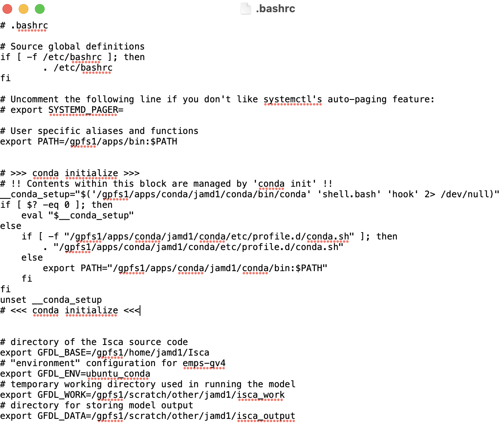
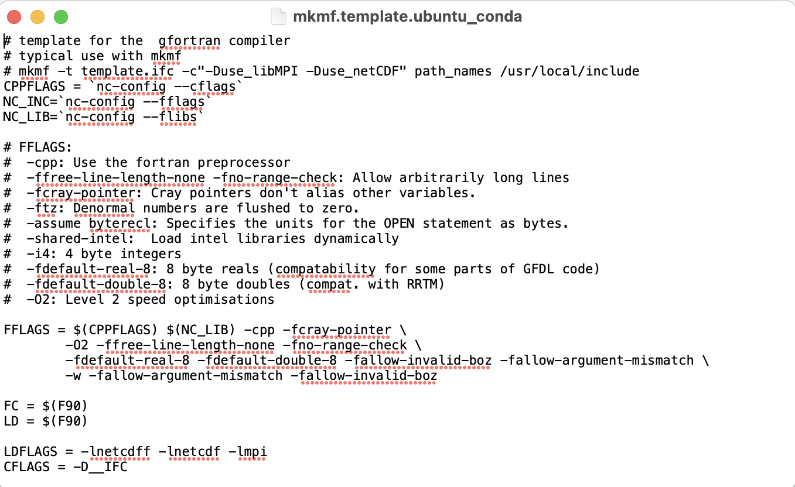
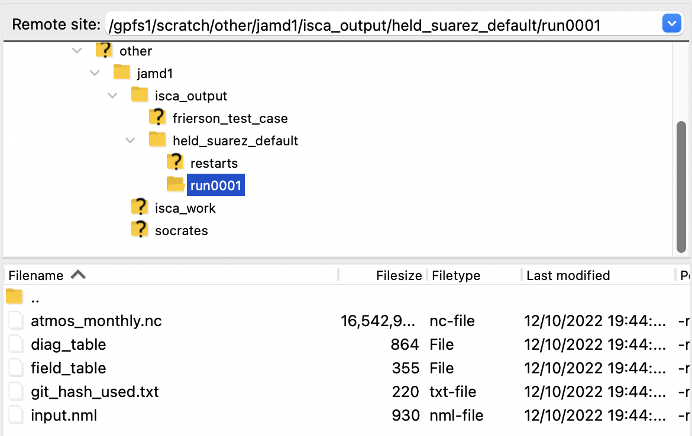

# Getting Started
Isca needs to be run on a powerful computer, so to use it, you first need to `ssh`
into a high performance computer e.g. [kennedy](../hpc_basics/kennedy.md#login).

## Installation
### Copy Source Code ([Step 2](https://github.com/ExeClim/Isca#getting-started))
- Once logged into the high performance computer, run </br> 
`git clone https://github.com/ExeClim/Isca`
- Then change the current directory </br>
`cd Isca`

### Create *CONDA* environment ([Step 3](https://github.com/ExeClim/Isca#getting-started))
- In terminal, run `conda env create -f ci/environment-py3.9.yml`. This takes around 5 minutes.
- Then, [run](../hpc_basics/kennedy.md#create-environment) `chmod u+x /gpfs1/apps/conda/$USER/conda/envs/*/bin/*` </br>
to make sure it is using the correct python version.

- Now you should be able to activate the *CONDA* environment: `conda activate isca_env`. I would probably
double check it is using the correct python version by running `which python`. </br>
It should return `/gpfs1/apps/conda/jamd1/conda/envs/isca_env/bin/python`.

### Install in development mode ([Step 4](https://github.com/ExeClim/Isca#getting-started))
- Change directory to where the *setup.py* file is: </br> `cd /gpfs1/home/jamd1/Isca/src/extra/python` </br>
- Install the `isca` python module in development mode: </br> `pip install -e .`

### Set environment and where Isca saves data
- Using [FileZilla](../hpc_basics/kennedy.md#file-transfer), create the directories 
*/gpfs1/scratch/other/\$USER/isca_work* and */gpfs1/scratch/other/\$USER/isca_output*.
- Add the following to the */gpfs1/home/jamd1/.bashrc* file, to indicate the Isca environment and where to 
save data. </br>
```bash
# directory of the Isca source code
export GFDL_BASE=/gpfs1/home/$USER/Isca
# "environment" configuration for emps-gv4
export GFDL_ENV=ubuntu_conda
# temporary working directory used in running the model
export GFDL_WORK=/gpfs1/scratch/other/$USER/isca_work
# directory for storing model output
export GFDL_DATA=/gpfs1/scratch/other/$USER/isca_output
```
- The full *.bashrc* file now looks like this: </br>
{width="500"}
- Exit the `ssh` and log back in for the new *.bashrc* script to take effect.
- This is close to the 
[Compiling for the first time section](https://github.com/ExeClim/Isca#compiling-for-the-first-time).

### Add Fortran compiler flags
- Check version of `gfortran` installed using `conda list -n isca_env`: </br>
```bash
gfortran                  10.4.0              h0c96582_10    conda-forge
gfortran_impl_linux-64    10.4.0              h44b2e72_16    conda-forge
gfortran_linux-64         10.4.0              h69d5af5_10    conda-forge
```
- If version is 10 or greater, the file </br> 
*/gpfs1/home/$USER/Isca/src/extra/python/isca/templates/mkmf.template.ubuntu_conda* </br>
needs to be changed, with the following: </br>
`-w -fallow-argument-mismatch -fallow-invalid-boz` </br>
added to the existing FFlags.
- The final file should look like this: </br>
{width="500"}

## Held Suarez
A simple experiment to run to check that the installation has worked is the 
[*Held Suarez*](https://github.com/ExeClim/Isca/blob/master/exp/test_cases/held_suarez/held_suarez_test_case.py) 
experiment.

To run this, you can do the following:

- [Login](kennedy.md#login) to kennedy.
- Run `conda activate isca_env` to activate the Isca *CONDA* environment.
- Create the following script, titled `held_suarez_run.sh`, and transfer it to a suitable location
on kennedy.
```bash
#!/bin/bash
#SBATCH --job-name=held_suarez_test
#SBATCH --output="held_suarez_test_output.txt"
#SBATCH --error="held_suarez_test_error.txt"
#SBATCH --time=02:00:00 # maximum walltime for the job
#SBATCH --nodes=1 # specify number of nodes
#SBATCH --ntasks-per-node=16 # specify number of processors per node
#SBATCH --mail-type=END # send email at job completion
#SBATCH --mail-user=$USER@st-andrews.ac.uk # email address
#SBATCH --partition=debug # queue to run on

python $GFDL_BASE/exp/test_cases/held_suarez/held_suarez_test_case.py
```
    - This will save the things printed to the console in `held_suarez_test_error.txt`, which
    will just be added to the same directory that the script is in. 
    You may want to change this to put it in another location.
    - This will use the debug queue as it should only take around 20 minutes to run.
- Submit the script: `sbatch held_suarez_run.sh` (make sure you are in the same directory as the file first).

As well as the `held_suarez_test_output.txt` and `held_suarez_test_error.txt` files, this should also generate
some output data in the folder </br> `/gpfs1/scratch/jamd1/isca_output/held_suarez_default/run0001`:

{width="500"}


## Running a General Experiment

### Required Files
To run a general experiment, you need to create two files, a [namelist](../namelists/index.md) *nml* file specifying the 
configuration options for the experiment and a diagnostic table file, specifying what diagnostics to save for the experiment.

The corresponding files for the [*Held Suarez*](#held-suarez) experiment are given below:

=== "namelist_hs.nml"
    ```nml
    ! This section gives info to give to SLURM when running experiment
    &experiment_details
       name = 'held_suarez'         ! Name of experiment
       n_months_total = 12
       n_months_job = 12
       n_nodes = 1
       n_cores = 16
       resolution = 'T42'
       partition = 'debug'          ! Queue to submit job to (Slurm info).
       overwrite_data = .false.
       compile = .false.
       max_walltime = '01:00:00'
    /
    
    &atmosphere_nml
        idealized_moist_model = .false.
    /
    
    &diag_manager_nml
        mix_snapshot_average_fields = .false.
    /
    
    &fms_io_nml
        fileset_write = 'single'
        threading_write = 'single'
    /
    
    &fms_nml
        domains_stack_size = 600000
    /
    
    &hs_forcing_nml
        delh = 60.0
        delv = 10.0
        do_conserve_energy = .true.
        eps = 0.0
        ka = -40.0
        kf = -1.0
        ks = -4.0
        sigma_b = 0.7
        t_strat = 200.0
        t_zero = 315.0
    /
    
    &main_nml
        calendar = 'thirty_day'
        current_date = 2000, 1, 1, 0, 0, 0
        days = 30
        dt_atmos = 600
    /
    
    &spectral_dynamics_nml
        damping_order = 4
        exponent = 7.5
        initial_sphum = 0.0
        reference_sea_level_press = 100000.0
        scale_heights = 6.0
        surf_res = 0.5
        valid_range_t = 100.0, 800.0
        vert_coord_option = 'uneven_sigma'
        water_correction_limit = 20000.0
        lon_max = 256
        lat_max = 128
        num_fourier = 85
        num_spherical = 86
        num_levels = 25
    /

    ```
=== "diag_table_hs"
    ```txt
    "FMS Model results"
    0001 1 1 0 0 0
    # = output files =
    # file_name, output_freq, output_units, format, time_units, long_name
    
    "atmos_monthly", 30, "days", 1, "days", "time",
    
    # = diagnostic field entries =
    # module_name, field_name, output_name, file_name, time_sampling, time_avg, other_opts, precision
    
    
    "dynamics", "ps", "ps", "atmos_monthly", "all", .true., "none", 2,
    "dynamics", "bk", "bk", "atmos_monthly", "all", .false., "none", 2,
    "dynamics", "pk", "pk", "atmos_monthly", "all", .false., "none", 2,
    "dynamics", "ucomp", "ucomp", "atmos_monthly", "all", .true., "none", 2,
    "dynamics", "vcomp", "vcomp", "atmos_monthly", "all", .true., "none", 2,
    "dynamics", "temp", "temp", "atmos_monthly", "all", .true., "none", 2,
    "dynamics", "vor", "vor", "atmos_monthly", "all", .true., "none", 2,
    "dynamics", "div", "div", "atmos_monthly", "all", .true., "none", 2,

    ```

The `namelist_hs.nml` file specifies all the 
[namelist options](https://github.com/ExeClim/Isca/blob/9560521e1ba5ce27a13786ffdcb16578d0bd00da/exp/test_cases/held_suarez/held_suarez_test_case.py#L47-L100) 
for the experiment. It also contains an additional `experiment_details` section which indicates information 
on how to run the simulation, most of which is relevant for submitting jobs to [*Slurm*](../hpc_basics/slurm.md):

- `name`: *string*. Name of experiment e.g. data saved in folder `$GFDL_DATA/{name}`
- `n_months_total`: *int*. Total duration of simulation in months.
- `n_months_job`: *int*. Approximate duration of each job of the simulation in months.
E.g. if `n_months_total=12` and `n_months_job=6`, the experiment would be split up into 2 jobs each
of length 6 months.
- `n_nodes`: *int*. Number of nodes to run job on (*Slurm* info).
- `n_cores`: *int*. Number of cores for each node to run job on (*Slurm* info).
- `resolution`: *string*. Horizontal resolution of experiment (options are `T21`, `T42` or `T85`).
- `partition`: *string*. *Slurm* queue to submit job to.
- `overwrite_data`: *bool*. If this is `True` and data already exists in `$GFDL_DATA/{name}`,
    then it will be overwritten. If it is `False` and the data exists, an error will occur.
- `compile`: *bool*. If `True`, it will recompile the codebase before running the experiment.
- `max_walltime`: *string*. Maximum time that job can run on *Slurm*. E.g. 1 hour would be '01:00:00'.

??? note "*nml* files"
    If a parameter is a boolean e.g. `overwrite_data` or `compile`, the format must be `.false.` or `.true.`.</br>
    If a parameter is a string e.g. `max_walltime`, `resolution` or `name` then quotation marks (`''`) must be used
    i.e. `name = 'held_suarez'`.

    `!` indicates a comment and will not be read in.

The `diag_table_hs` file specifies all the 
[diagnostics](https://github.com/ExeClim/Isca/blob/9560521e1ba5ce27a13786ffdcb16578d0bd00da/exp/test_cases/held_suarez/held_suarez_test_case.py#L30-L41) 
to save to the output directory.

### Running
To run a general experiment, download the `isca_tools` folder from the 
[Github repository](https://github.com/jduffield65/Isca) and [transfer](../hpc_basics/kennedy.md#file-transfer) it 
to your home directory on [*kennedy*](../hpc_basics/kennedy.md).

Once you have done this, and have [created](#required-files) a namelist file with path 
`isca_jobs/experiment/namelist.nml` and diagnostic table file with path `isca_jobs/experiment/diag_table`, you can
do the following:

- [Login](kennedy.md#login) to kennedy.
- Run `conda activate isca_env` to activate the Isca *CONDA* environment.
- Run: 
```bash
python isca_tools isca_jobs/experiment/namelist.nml isca_jobs/experiment/diag_table True
```

The `True` in the above line of code indicates that the jobs should be submitted to *Slurm*. If this third parameter 
is `False` or not given, then it won't use *Slurm* but just [run on *kennedy*](../hpc_basics/slurm.md#debugging).
This may be useful for debugging small jobs.

What this last line of code does is call the function 
[`run_experiment`](../code/run/base.md#isca_tools.run.base.run_experiment).

### Output Data
This will save data to the folder `/gpfs1/scratch/jamd1/isca_output/name/` where `name` is the value of `name`
indicated in the `experiment_details` section of the [`namelist.nml`](#required-files) file.

There will be a folder for each month e.g. `run0003` will contain the data for the third month.

If *Slurm* is used, there will also be a folder titled `console_output`. This which will contain a file titled `error1.txt` 
containing all the stuff *Isca* printed to the console for the job starting on month 1, as well as a file
titled `time1.txt`, which contains the time taken for that job to run. If the experiment was split over
multiple jobs, there will be multiple `error.txt` and `time.txt` files, each indexed with the month 
that they started on.
