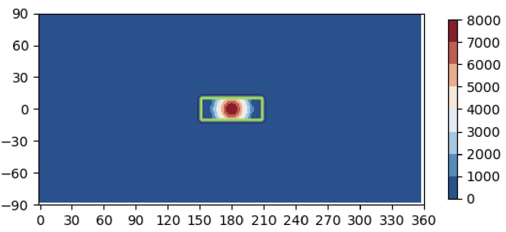

# Land
To run an experiment with land, a *.nc* file needs to be created indicating where the land is and the 
topography.

This can be done using the 
[`write_land`](../code/land/base.md#isca_tools.land.base.write_land) function.

## Square Example
To produce a file called `land.nc` within the [`input_dir`](../namelists/main/experiment_details.md#input_dir) for an 
experiment that has a single block of land in the range $-10 \leq \phi \leq 10$; $150 \leq \lambda \leq 210$ with 
a single $8km$ high mountain in the center, I would run the following:

=== "Code"
    ```python
    from isca_tools import write_land
    from isca_tools.plot import show_land
    import numpy as np
    write_land('land.nc', '/gpfs1/home/jamd1/Isca/jobs/experiment/namelist.nml', 'square', [-10, 10, 180-30, 180+30],
               topography='gaussian', topography_gauss=[0, 180, 20, 10, 8000])
    show_land('/gpfs1/home/jamd1/Isca/jobs/experiment/land.nc')
    ```
=== "`namelist.nml`"
    ```nml
    &experiment_details
        name = 'experiment'             
        input_dir = '/gpfs1/home/jamd1/Isca/jobs/experiment/'   
        n_months_total = 120          ! 10 year simulation
        n_months_job = 12             ! Each job is 1 year
        n_nodes = 1                 
        n_cores = 16                 
        resolution = 'T42'           
        partition = 'debug'         
        overwrite_data = .false.    
        compile = .false.           
        max_walltime = '01:00:00'  
        delete_restart_files = .true.
    /

    &main_nml
        calendar = 'thirty_day'
        current_date = 1, 1, 1, 0, 0, 0
        days = 30
    /

    &atmosphere_nml
        idealized_moist_model = .true.
    /

    &idealized_moist_phys_nml
        land_option = 'input'
        land_file_name = 'INPUT/land.nc'
        land_roughness_prefactor = 10
    /

    &surface_flux_nml
        land_humidity_prefactor = 0.7                   
        land_evap_prefactor = 0.7                       
    /

    &mixed_layer_nml
        land_option = 'input'       
        land_albedo_prefactor = 1.3   
        land_h_capacity_prefactor = 0.1                
    /

    &spectral_init_cond_nml
        topography_option = 'input'
        topog_file_name = 'land.nc'
    /
    ```

The `land.nc` file will contain two variables: `land_mask` is set to $1$ if a given latitude/longitude coordinate 
corresponds to land, otherwise it will be $0$. `zsurf` indicates the height in meters at each 
latitude/longitude coordinate.

The [`show_land`](../code/plot/land.md#isca_tools.plot.land.show_land) function is useful for checking that the 
location of the land and topography are as expected. The green outline indicates where land is and the colormap
indicates the topography:

{width="700"}

Once the `land.nc` file has been created and looks correct, the experiment can be [run](getting_started.md#running) as
normal.

## Namelist options
The `namelist.nml` file in the `square` example only indicates the options related to land. In *Isca*, [land can be 
specified to differ from ocean in four ways](https://execlim.github.io/Isca/modules/surface_flux.html#land):

1. Roughness length - Land tends to be rougher than ocean.
2. Evaporative flux - It is easier to evaporate water from ocean than land.
3. Albedo - Land tends to reflect more sunlight than ocean.
4. Heat capacity - Land has a smaller heat capacity than ocean and so responds more quickly to external forcing.

Each of the land options specified in the `namelist.nml` file are related to one of these:

* [`land_option`](../namelists/main/idealized_moist_physics.md#land_option) - Indicates that the experiment uses land.
This option must also be specified in the 
[`mixed_layer_nml`](../namelists/surface/mixed_layer.md#land_option) namelist.
* [`land_file_name`](../namelists/main/idealized_moist_physics.md#land_file_name) - Name of land *.nc* file used.
* [`land_roughness_prefactor`](../namelists/main/idealized_moist_physics.md#land_roughness_prefactor) - (1)
* [`land_humidity_prefactor`](../namelists/surface/surface_flux.md#land_humidity_factor) - (2)
* [`land_evap_prefactor`](../namelists/surface/surface_flux.md#land_evap_prefactor) - (2)
* [`land_albedo_prefactor`](../namelists/surface/mixed_layer.md#land_albedo_prefactor) - (3)
* [`land_h_capacity_prefactor`](../namelists/surface/mixed_layer.md#land_h_capacity_prefactor) - (4)
* [`topography_option`](../namelists/surface/topography.md#topography_option) - Indicates that the experiment uses 
topography.
* [`topog_file_name`](../namelists/surface/topography.md#topog_file_name) - Name of land *.nc* file used.

