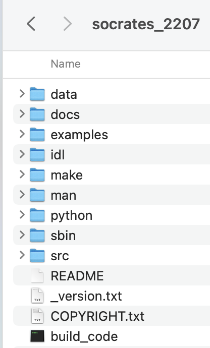

# SOCRATES
To run an experiment with the [*SOCRATES*](../namelists/radiation/socrates.md) 
[radiation scheme](../namelists/main/idealized_moist_physics.md#do_socrates_radiation), you need to get the
*SOCRATES* source code because it is not included with *Isca*.

The following goes through how to modify *Isca*, so it can be used with *SOCRATES* and then how to run a simple 
experiment. It is based on the instructions on the 
[*Isca* website](https://github.com/ExeClim/Isca/blob/master/exp/test_cases/socrates_test/README.md).

## Adding SOCRATES to Isca
### Get source code
To get the source code, you require a Met Office Science Repository Service (*MOSRS*) account. 
To get one of these, email the radiation code owner which, as of November 2022, was 
[Dr James Manners](https://www.metoffice.gov.uk/research/people/james-manners): james.manners@metoffice.gov.uk.

You should then be sent a username and then be asked to create a password.

Once you have an account, download the latest version of the *SOCRATES* source code from the 
[*MOSRS* website](https://code.metoffice.gov.uk/trac/socrates) (this was 22.07 as of November 2022).

### Put source code in *Isca* directory
{width="200", align=left}
The *SOCRATES* source code that you have just downloaded should look something like the folder on the left.

Move everything contained in this folder to: </br>`$GFDL_BASE/src/atmos_param/socrates/src/trunk/` </br> so
that it is within the *Isca* source code (you may need to create the `trunk` folder first).

I would also add the following line to the 
[*.bashrc* file](getting_started.md#set-environment-and-where-isca-saves-data):
```bash
export GFDL_SOC=/gpfs1/home/$USER/Isca/src/atmos_param/socrates/src/trunk/
```
to indicate where the *SOCRATES* source code is located. 
The `/gpfs1/home/$USER/Isca/` part should be whatever `GFDL_BASE` is in your *.bashrc* file.

### Edit the number of angles in the phase function
This is just step 3 from the 
[*Isca* instructions](https://github.com/ExeClim/Isca/blob/master/exp/test_cases/socrates_test/README.md#3-edit-the-number-of-angles-in-the-phase-function).

Open the file </br>
`$GFDL_BASE/src/atmos_param/socrates/src/trunk/src/modules_core/dimensions_spec_ucf.F90`</br>
and make the following changes:

```fortran
npd_k_term=14
npd_scale_variable = 4
npd_continuum = 2
npd_drop_type = 5
npd_cloud_parameter = 30
npd_phase_term = 1
```
The final one of these is the most important, as a large value for this term significantly 
increases *Socrates'* memory usage, and will make *Isca* much slower.

### Change the `path_names` file
As indicated in step 6 of the [*Isca* instructions](https://github.com/ExeClim/Isca/blob/master/exp/test_cases/socrates_test/README.md#6-if-you-find-socrates-doesnt-compile),
*Isca's* Python front-end uses a static list of file names to be compiled for the *SOCRATES* version of Isca.

These are indicated in the following file:

`$GFDL_BASE/src/extra/model/socrates/path_names`

However, the list was compiled from a version of *SOCRATES* around $17$. 
Thus, it is now out of date and needs updating:

* Take the original `path_names` file and delete all names which include the directory </br> 
`atmos_param/socrates/src/trunk/src/radiation_control`.
* Delete all names which include the directory </br>
`atmos_param/socrates/src/trunk/src/radiance_core`.
* Using the code below (`jamd1` should be replaced with your username), 
find all files in `radiance_core` directory of the *SOCRATES* source code and add them to the `path_names` file:
```python
import os
for root, dirs, files in os.walk(os.path.abspath('/gpfs1/home/jamd1/Isca/src/atmos_param/socrates/src/trunk/src/radiance_core')):
    for file in files:
        print(os.path.join(root, file).replace('/gpfs1/home/jamd1/Isca/src/', ''))
```
* At this stage, I would [run a *SOCRATES* test experiment](#running-a-simple-experiment) with 
[`compile=True`](../namelists/main/experiment_details.md#compile)
to see what errors you get. You will probably get an *opening file* error due to a file being specified in `path_names`
which does not exist e.g.

If you get this, just delete the name of this file from the `path_names` folder. For me, with v22.07 of *SOCRATES*, 
this only occured for the file </br>
`atmos_param/socrates/src/trunk/src/aux/interpolate_p.f`.

## Running a simple experiment
The simple *SOCRATES* experiment that I [ran](getting_started.md#running-a-general-experiment), was just taking the 
[*Frierson*](https://github.com/ExeClim/Isca/blob/master/exp/test_cases/frierson/frierson_test_case.py) test experiment
and making the following modifications:

* Set [`albedo`](../namelists/surface/mixed_layer.md#albedo_value) to $0.38$ to reflect value used 
in [`socrates_aquaplanet.py`](https://github.com/ExeClim/Isca/blob/master/exp/test_cases/socrates_test/socrates_aquaplanet.py)
example script.
* Set [`depth`](../namelists/surface/mixed_layer.md#depth) to $5m$.
* Set up the [`socrates_nml`](../namelists/radiation/socrates.md) namelist set up with the values used in the 
[`socrates_aquaplanet.py`](https://github.com/ExeClim/Isca/blob/master/exp/test_cases/socrates_test/socrates_aquaplanet.py) 
example script.</br>
To do this, you will need to add the 
[`ozone_1990.nc`](https://github.com/ExeClim/Isca/blob/master/input/rrtm_input_files/ozone_1990.nc) file
into the [`input_dir`](../namelists/main/experiment_details.md#input_dir).</br>
The `lw_spectral_filename` and `sw_spectral_filename` options may need altering as well, to indicate the correct files 
e.g. in the `namelist.nml` file given below, you would have to use your username rather than `jamd1`.

??? note "Files used"
    The `namelist.nml` and `diag_table` files used are indicated below:
    === "`namelist.nml`"
        ```nml
        ! This experiment is the same as frierson_test_case but with socrates radiation as specified
        ! in the socrates_aquaplanet.py example and with a mixed layer depth of 5m rather 2.5m in the mixed_layer_nml namelist.
        ! Albedo is also set to 0.38 as used for the byrne radiation.
        ! It is also run for 10 years.
        
        ! This section gives info to give to Slurm when running experiment
        &experiment_details
           name = 'test/socrates'                ! Name of experiment e.g. data saved to folder $GFDL_DATA/name.
           input_dir = '/gpfs1/home/jamd1/isca_jobs/test/socrates/'
           n_months_total = 1           ! Total duration of simulation in months.
           n_months_job = 1             ! Approximate duration of each job of the simulation in months.
                                        ! If n_months_total=12 and n_months_job=6, would have 2 jobs, each of length 6 months.
           n_nodes = 1                  ! Number of nodes to run job on (Slurm info).
           n_cores = 32                  ! Number of cores for each node to run job on (Slurm info).
           resolution = 'T42'           ! Horizontal resolution of experiment ('T21', 'T42' or 'T85').
           partition = 'debug'          ! Queue to submit job to (Slurm info).
           overwrite_data = .false.     ! If .true. and data already exists in $GFDL_DATA/name, it will be overwritten.
           compile = .false.            ! If .true. it will recompile the codebase before running the experiment.
           max_walltime = '02:00:00'    ! Maximum time that job can run e.g. '01:00:00' would be 1 hour (Slurm info).
           delete_restart_files = .true.    ! Only want to save 1 restart file
        /
        
        &main_nml
            calendar = 'thirty_day'
            current_date = 1, 1, 1, 0, 0, 0
            days = 30
            dt_atmos = 720
            hours = 0
            minutes = 0
            seconds = 0
        /
        
        &idealized_moist_phys_nml
            do_damping = .true.
            turb = .true.
            mixed_layer_bc = .true.
            do_virtual = .false.
            do_simple = .true.
            roughness_heat = 3.21e-05
            roughness_moist = 3.21e-05
            roughness_mom = 3.21e-05
            two_stream_gray = .false.
            do_socrates_radiation = .true.
            convection_scheme = 'SIMPLE_BETTS_MILLER'
        /
        
        &vert_turb_driver_nml
            do_mellor_yamada = .false.      ! default is True
            do_diffusivity = .true.         ! default is False
            do_simple = .true.              ! default is False
            constant_gust = 0.0             ! default is 1.0
            use_tau = .false.
        /
        
        &diffusivity_nml
            do_entrain = .false.
            do_simple = .true.
        /
        
        &surface_flux_nml
            do_simple = .true.
            old_dtaudv = .true.
            use_virtual_temp = .false.
        /
        
        &atmosphere_nml
            idealized_moist_model = .true.
        /
        
        &mixed_layer_nml
            albedo_value = 0.38                 ! Frierson was 0.31, need to increase for it to converge with byrne.
                                                ! socrates_aquaplanet.py also has 0.38 so keeping this value.
            depth = 5.0                         ! different from frierson_test_case value of 2.5
            evaporation = .true.
            prescribe_initial_dist = .true.
            tconst = 285.0
        /
        
        &qe_moist_convection_nml
            tmax = 350.0
            tmin = 160.0
            rhbm = 0.7
        /
        
        ! Not sure why we need this namelist as we are doing simple betts miller which uses qe_moist_convection_nml
        &betts_miller_nml
            rhbm = 0.7
            do_simp = .false.
            do_shallower = .true.
        /
        
        &lscale_cond_nml
            do_evap = .true.
            do_simple = .true.
        /
        
        &sat_vapor_pres_nml
            do_simple = .true.
        /
        
        &damping_driver_nml
            do_conserve_energy = .true.
            do_rayleigh = .true.
            sponge_pbottom = 5000.0         ! Bottom of the model's sponge down to 50hPa (units are Pa)
            trayfric = -0.25
        /
        
        &diag_manager_nml
            mix_snapshot_average_fields = .false.       ! time avg fields are labelled with time in middle of window
        /
        
        
        &fms_io_nml
            fileset_write = 'single'        ! default is multi
            threading_write = 'single'      ! default is multi
        /
        
        &fms_nml
            domains_stack_size = 600000     ! default is 0
        /
        
        &spectral_dynamics_nml
            damping_order = 4
            water_correction_limit = 200.e2
            reference_sea_level_press = 1.0e5
            num_levels = 25                         ! How many pressure levels to use
            valid_range_t = 100.0, 800.0
            initial_sphum = 2e-06
            vert_coord_option = 'input'             ! Use the vertical levels from Frierson 2006
            surf_res = 0.5
            scale_heights = 11.0
            exponent = 7.0
            robert_coeff = 0.03
        /
        
        ! Specify vertical levels from Frierson 2006
        &vert_coordinate_nml
            bk = 0.000000, 0.0117665, 0.0196679, 0.0315244, 0.0485411, 0.0719344, 0.1027829, 0.1418581, 0.1894648, 0.2453219, 0.3085103, 0.3775033, 0.4502789, 0.5244989, 0.5977253, 0.6676441, 0.7322627, 0.7900587, 0.8400683, 0.8819111, 0.9157609, 0.9422770, 0.9625127, 0.9778177, 0.9897489, 1.0000000
            pk = 0.000000, 0.000000, 0.000000, 0.000000, 0.000000, 0.000000, 0.000000, 0.000000, 0.000000, 0.000000, 0.000000, 0.000000, 0.000000, 0.000000, 0.000000, 0.000000, 0.000000, 0.000000, 0.000000, 0.000000, 0.000000, 0.000000, 0.000000, 0.000000, 0.000000, 0.000000
        /
        
        ! Specify socrates radiation using parameters given in socrates_aquaplanet.py script.
        &socrates_rad_nml
            stellar_constant = 1370
            lw_spectral_filename = '/gpfs1/home/jamd1/Isca/src/atmos_param/socrates/src/trunk/data/spectra/ga7/sp_lw_ga7'
            sw_spectral_filename = '/gpfs1/home/jamd1/Isca/src/atmos_param/socrates/src/trunk/data/spectra/ga7/sp_sw_ga7'
            do_read_ozone = .true.
            ozone_file_name = 'ozone_1990'
            ozone_field_name = 'ozone_1990'
            dt_rad = 3600
            store_intermediate_rad = .true.
            chunk_size = 16
            use_pressure_interp_for_half_levels = .false.
            tidally_locked = .false.
            solday = 90
        /

        ```    
    === "`diag_table`"
        ```txt
        "FMS Model results"
        0001 1 1 0 0 0
        # = output files =
        # file_name, output_freq, output_units, format, time_units, long_name
        
        "atmos_monthly", 30, "days", 1, "days", "time",
        
        # = diagnostic field entries =
        # module_name, field_name, output_name, file_name, time_sampling, time_avg, other_opts, precision
        
        "mixed_layer", "t_surf", "t_surf", "atmos_monthly", "all", .true., "none", 2,
        "socrates", "soc_olr", "soc_olr", "atmos_monthly", "all", .true., "none", 2,
        "socrates", "soc_toa_sw", "soc_toa_sw", "atmos_monthly", "all", .true., "none", 2,
        ```

The first time you run it, you need to compile the *SOCRATES* code, which is achieved by setting
[`compile=True`](../namelists/main/experiment_details.md#compile) (set to `False` again after it has worked once). You also probably want a very short simulation
duration when debugging to check that *SOCRATES* is working. 
I did this by setting [`days=3`](../namelists/main/index.md#days).
