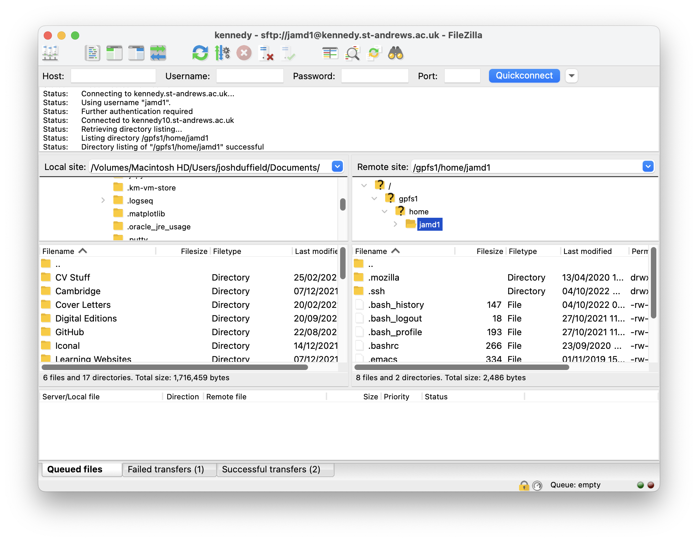

# kennedy
The following gives some instructions on how to get an account on kennedy and then login.
## Getting an account
- Register for an account [🔗](https://www.st-andrews.ac.uk/high-performance-computing/register/access.htm).
- Create a public ssh key.
    - Follow [these instructions](https://www.siteground.co.uk/kb/how_to_generate_an_ssh_key_pair_in_mac_os/).
    - I would not enter a password and leave the folder as the default.
    - You should have created a private key (*id_rsa*) and a public key (*id_rsa.pub*). For me, these were saved to 
    */Users/joshduffield/.ssh/*.
- Email the public key to Herbert (*herbert.fruchtl@st-andrews.ac.uk*) so he can make you an account.
    - He should then email you a username and password.
- If on Mac, install [XQuartz](https://www.xquartz.org/) on your local computer.

## Login
!!! note "Username"
	Your kennedy username will probably be the same as your normal St Andrews one. In the following, I have left 
	my username, *jamd1*, so just replace this wherever it appears with your username.

- To login, run the following in terminal
```bash
ssh jamd1@kennedy.st-andrews.ac.uk
```
- You may get the following message:
```bash
The authenticity of host 'kennedy.st-andrews.ac.uk (138.251.14.67)' can't be established.
ED25519 key fingerprint is SHA256:eZyafolEFuPQuBBSJtBr55VbWI9Hmuko3GUkuV0vfaw.
This key is not known by any other names
Are you sure you want to continue connecting (yes/no/[fingerprint])?
```
If so, just say `yes`
- Then it will call for the password:
      ```bash
      jamd1@kennedy.st-andrews.ac.uk's password:
      ```
- If logged in successfully, the following should appear:
```bash
Last login: Fri Sep 30 16:07:23 2022
Welcome to kennedy
Please find information about using it at the HPC website:
https://www.st-andrews.ac.uk/high-performance-computing/
[jamd1@kennedy10 ~]$
```

## Change Password
On first login, the password should be changed using the command `passwd`:
```bash
[jamd1@kennedy10 ~]$ passwd
Changing password for user jamd1.
Current Password: 
New password: 
Retype new password: 
passwd: all authentication tokens updated successfully.
[jamd1@kennedy10 ~]$ 
```

## File Transfer
??? note "Using Terminal"
    You can exchange files between your local computer and kennedy using terminal:
    ```bash
    sftp jamd1@kennedy.st-andrews.ac.uk
    jamd1@kennedy.st-andrews.ac.uk's password: 
    Connected to kennedy.st-andrews.ac.uk.
    sftp> 
    ```

    - Then use `cd <dir>` to change directory
    - `put <file>` to move file from local computer to kennedy.
    - `get <file>` to move file from kennedy to local computer.

I find it easiest to exchange files using [FileZilla](https://filezilla-project.org/) which has a graphical interface.

- Download it from this [website](https://filezilla-project.org/download.php?type=client#close)
- Next, you need to specify the private key which was [created earlier](#getting-an-account).
    - In FileZilla, in the top bar, click *Edit* and then *Settings*.
    - Then click *Connection/SFTP* and then *Add key file*.
    - Select the private key [created earlier](#getting-an-account) i.e. it should be called *id_rsa*. <br>
    {width="300"}
    - Then press *OK* <br>
    {width="300"}
    - This comes from the *On a Mac* section on the [wiki](https://wiki.filezilla-project.org/Howto#On_a_Mac). 

- Now, in the top bar, click *File* and then *Site Manager*
    - Create a *New Site* for *kennedy*.
    - Protocol: *SFTP*
    - Host: *kennedy.st-andrews.ac.uk*
    - Username and password is the same as used to [login](#login). <br>
    {width="300"}
    - Then click *Connect* and it should hopefully work with a screen like the following appearing. <br>
    {width="300"}
- You should now be able to drag and drop files from the local computer (left) to kennedy (right) and create new 
directories etc.

## CONDA
### Installation
To install *CONDA*, [login](#login) and then run `install-conda` in terminal.
This should then produce some files in the location */gpfs1/apps/conda/jamd1/conda*: <br>
 {width="300"}

### Create Environment
To create a `python 3.9` conda environment called `test_env` run:
```bash
conda create -n test_env python=3.9
```
Then to activate it, run:
```bash
conda activate test_env
```
Terminal should then look something like this:
```
(test_env) [jamd1@kennedy10 ~]$
```
???+ error "Wrong Python Version"

    If you now run `python -V` to check the python version, it will print `Python 2.7.5` even though the conda 
    environment is `python 3.9`.
    
    This is because it is using the wrong python. If you run `which python`, it will print `/usr/bin/python` which 
    has nothing to do with the `test_env` *CONDA* environment.

    The problem is that the python installed using *CONDA* does not have execution permissions, so it reverts to 
    a python version which does. To give execution permissions, you can run the following line (The `$USER` will 
    automatically be your username so you don't need to change it):
    ```bash
    chmod u+x /gpfs1/apps/conda/$USER/conda/envs/*/bin/*
    ```

    If you now run `conda deactivate` and then `conda activate test_env` to log out and then back into the *CONDA* 
    environment, `python -V` should now print `Python 3.9.13` and `which python` should print </br>
    `/gpfs1/apps/conda/jamd1/conda/envs/test_env/bin/python`.


## Resources
There is a [website](https://www.st-andrews.ac.uk/high-performance-computing/) for kennedy. There is also
a recorded 
[lecture](https://st-andrews.cloud.panopto.eu/Panopto/Pages/Viewer.aspx?id=cfe68199-3d75-42c5-97de-ad3b00f42710)
and the corresponding 
[lecture notes](https://www.st-andrews.ac.uk/assets/university/high-performance-computing/documents/kennedy_intro_June21.pdf).

These may be useful, especially if using an operating system other than *Mac*.
