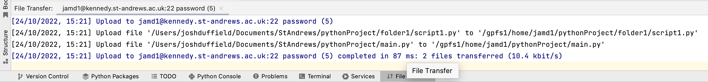

# Pycharm
My preferred IDE for *python* is [*Pycharm*](https://www.jetbrains.com/pycharm/). The following gives instructions
on how files can be synced between your local computer and a high performance computer e.g. [kennedy](kennedy.md) 
using *Pycharm*.

Then, you basically code as you normally would on your local computer but everything happens on the high performance
computer.

## Syncing a Pycharm Project
Pycharm also provides a useful [video](https://www.youtube.com/watch?v=6RlgQBB1UDU) and
[instructions](https://www.jetbrains.com/help/pycharm/configuring-remote-interpreters-via-ssh.html).

* First, [login to kennedy](kennedy.md#login) and [create a *CONDA* environment](kennedy.md#create-environment). I will
be using an environment called `test_env`.

* Next, create a *Pycharm* project. I wouldn't worry too much about the python interpreter as we will later 
change this to use the *CONDA* environment we just set up on the high performance computer. I would probably just use 
set up a *CONDA* environment or use one that is already been set up.

* Create a couple of files in the project so we can sync it to the high performance computer e.g.</br>
{width="700"}

* Next choose the remote *CONDA* environment as the python interpreter by following the 5 steps indicated below.

    === "1"
        {width="700"}
    === "2"
        {width="400"}
    === "3"
        {width="400"}
    === "4"
        {width="400"}
    === "5"
        {width="700"}

      **1.**Click on your current python interpreter in the bottom right (*Python 3.9 (Isca)* for me). 
      Then add a new *SSH* interpreter.</br>
      **2.**Enter your *kennedy* login details.</br>
      **3.**Enter the corresponding password.</br>
      **4.**You should get a confirmation message indicating that you connected successfully.</br>
      **5.**In the next screen, select an existing environment.</br>In the *Interpreter* section, select the python file from 
      the *CONDA* environment you want to use.</br>In the *Sync folders* section, enter the address on *kennedy* where you 
      would like the project to be saved (The project name must be the same as it is on your local computer though 
      i.e. *pythonProject* for me).

* After confirming this, you should get a *File Transfer* tab in the bottom toolbar, indicating the files 
in the project have been transferred. When changes are made to these files locally, they will also be changed 
remotely.</br>
{width="700"}

    ??? warning "Remote Files don't get deleted when deleted locally"
        By default, when you delete a file locally, the remote equivalent does not get deleted. </br>
        To change this, go to Tools → Deployment → Options. </br>
        Then tick the *Delete remote files when local are deleted* box:
        === "Tools → Deployment → Options"
            {width="400"}
        === "Delete remote files when local are deleted"
            {width="250"}

## Python Console and Terminal
The *Python Console* in the bottom toolbar should now be using the remote *CONDA* version of python as indicated
by the first line in blue and the current path is the remote project as indicated by the last blue line, starting
`sys.path.extend`:
{width="400"}

However, this *CONDA* version of python may not have anything installed yet, hence I get the error when trying 
to import `numpy`. To install a package on the remote *CONDA*, go to the *Terminal* tab in the bottom toolbar and 
start a *SSH* terminal session by clicking the downward arrow and selecting the correct *Remote Python* option:

{width="500"}

This will log you into *kennedy* without asking for login details seen as you have already provided them.
Then, [activate](kennedy.md#create-environment) the *CONDA* environment and install the package (`pip install numpy`).
If you then restart the *Python Console*, you should now be able to import `numpy`.

## Debugging
I think that one of the main advantages of using *Pycharm* is the debugging feature, so you can pause a function 
in real time to see the variables or see why it is hitting an error. This feature can also be used in this remote 
setup.

First, create a [run configuration](https://www.jetbrains.com/help/pycharm/run-debug-configuration.html) for the 
script that you want to run. I will be using `script1.py`:

{width="500"}

Then, to run in debug mode, click the little beetle in the top right. If you then add a breakpoint somewhere, 
the code should stop at that point, so you can see the value of all the variables:

{width="700"}

## Jupyter Notebook
The following comes from this [website](https://medium.com/analytics-vidhya/connecting-remote-server-via-pycharm-53414d0da93f).

* On the remote computer, install `jupyterlab` in your *CONDA* environment: </br>
`conda install -c conda-forge jupyterlab`.
* Next, start a [*screen*](https://www.tecmint.com/screen-command-examples-to-manage-linux-terminals/) session, so you 
can drop in and out of it and leave it running for ages:</br>
`screen -S jupyter_test`
* Then, run the following to enable a jupyter connection:

    ```bash
    conda activate test_env
    chmod u+x /gpfs1/apps/conda/$USER/conda/envs/*/bin/*
    jupyter lab --no-browser --port=1111
    ```

    The [second line](kennedy.md#error---wrong-python-version) is just to ensure you have permission to use jupyter. 
    I get a *Permission Denied* error without doing this.
    The *port* in the last line can be any 4 digit number.
    
* You should then get a list of links:</br>
    {width="700"}
* Next, open a local terminal window and type:

    ```bash
    ssh -N -f -L localhost:1111:localhost:1111 jamd1@kennedy.st-andrews.ac.uk
    ```
    You will have to enter your *kennedy* password.

*  Next, create a jupyter notebook in *Pycharm* as indicated by the first image below:

    === "Create Notebook"
        {width="400"}
    === "Configure Notebook"
        {width="700"}
    === "Example Notebook"
        {width="700"}
    Then configure the notebook (button in top right of notebook), by specifying the *Configured Server* to be 
    the last link that was printed out when creating the jupyter connection (second image.</br>
    You should now be able to create a notebook, with access to the environmental variables on the remote computer
    as indicated by the third image.

* If you prefer the normal browser interface for the jupyter notebook, you can click the globe in the rop right corner.
* If you keep the *screen* session going, you should only have to re-run the line </br>
`ssh -N -f -L localhost:1111:localhost:1111 jamd1@kennedy.st-andrews.ac.uk`</br> 
everytime you want to use the notebook again.
* You may need to restart the screen session every now and again with a new port number. I had to do this 
because I recieved an error: Run error - connection reset.

??? warning "Changes to jupyter notebook files do not sync to remote computer"
    To upload the changes you made to the jupyter notebook file locally, you can use:</br>
    Tools → Deployment → Sync with Deployed to jamd1@kennedy...</br>
    Make sure you are using the blue arrow to sync from your local to the remote computer.
